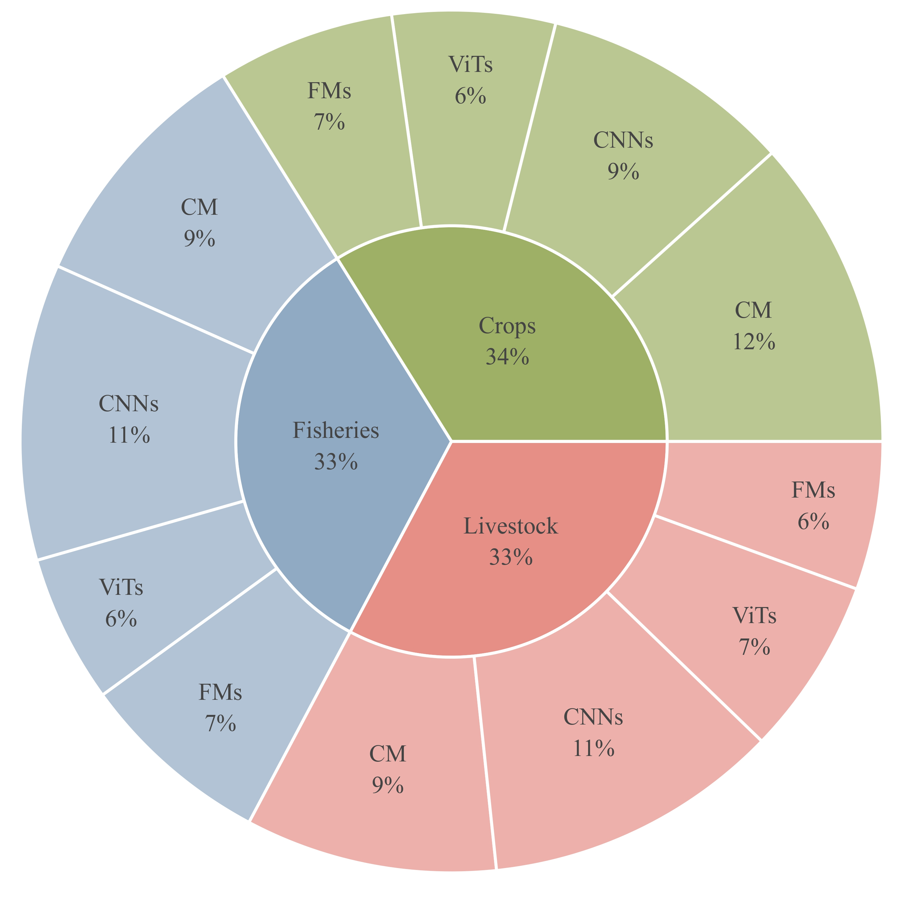
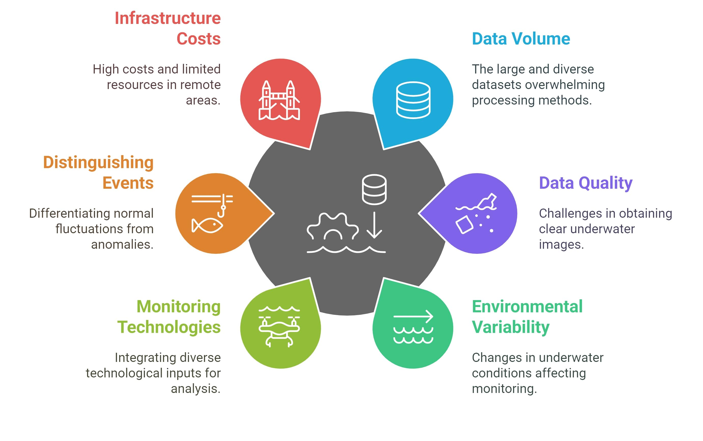
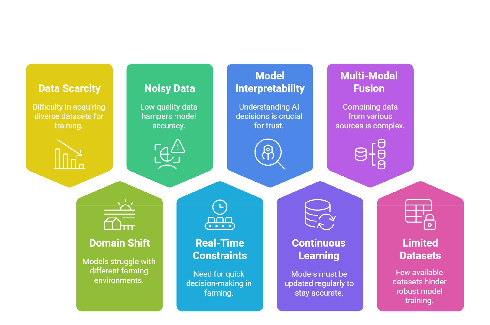

# AI in Agriculture — A Survey of Deep Learning Techniques for Crops, Fisheries and Livestock

[](https://opensource.org/licenses/MIT)  [](TBA)  [](https://github.com/umair1221/AI-in-Agriculture)
[]()

<p align="center">
    
</p>

#### [Umair Nawaz](https://scholar.google.com/citations?user=w7N4wSYAAAAJ&hl=en), [Muhammad Zaigham Zaheer](https://scholar.google.com/citations?user=nFxWrXEAAAAJ&hl=en), [Fahad Shahbaz Khan](https://sites.google.com/view/fahadkhans/home), [Hisham Cholakkal](https://scholar.google.com/citations?user=bZ3YBRcAAAAJ&hl=en), [Salman Khan](https://salman-h-khan.github.io/), [Rao M. Anwer](https://scholar.google.fi/citations?user=_KlvMVoAAAAJ&hl=en)

---

<p align="center">
  
<!--    -->
</p>

---
## 1. What is this repository?
This repository complements our survey paper, **“AI in Agriculture: A Survey of Deep Learning Techniques for Crops, Fisheries and Livestock”**, which is a comprehensive review of machine and deep-learning techniques for (A) crops, (B) fisheries, and (C) livestock domain. It provides readers with:
- a curated index of **200+ referenced papers**;
- high-resolution artwork (taxonomy diagrams, dataset examples, etc.);
- guidelines for contributing new references once the survey is published.  

<p align="center">
  
<!--    -->
</p>


The goal is to make it effortless for researchers, practitioners and students to navigate the literature, replicate our analyses and extend the survey as the field evolves. The Pie chart represents the distribution of papers discussed in this survey under four methodological categories (CM: Conventional Methods, CNNs: Convolutional Neural Networks, ViTs: Vision Transformers, FMs: Foundational Models). Each domain’s angular span is proportional to its total paper count, and each inner slice’s radial extent encodes the method’s share within that domain in this survey.

## 2. Paper at a glance

| Highlight | Details |
|-----------|---------|
| **Domains covered** | Crops, Livestock, Fisheries |
| **Techniques reviewed** | Conventional ML, CNNs, Vision Transformers, Vision-Language & Foundation Models |
| **Key themes** | Datasets & Benchmarks · Task Taxonomy · Implementation Challenges · Future Directions |
| **Total Papers Covered** | 200+ peer-reviewed papers and preprints |
| **Journal / venue** | *Pre-print*, under submission |

Feel free to ⭐ star and fork this repository to keep up with the latest advancements and contribute to the community.

---
<p align="center">
  
<!--    -->
</p>

A taxonomy of AI applications in *agriculture* divided into three domains: crops, livestock, and fisheries. We highlight various ML tasks for each domain along with the domain-specific challenges. Furthermore, a detailed overview of common datasets in each domain is specified, along with different approaches used, ranging from conventional ML methods to foundation models.

---

## 📌 Contents  

| Section | Subsection |  
| --------------------- | ----------- |  
| [📖 Introduction]() | [Motivation & Scope](), [Contributions](), [Organization]() |  
| [🌾 AI for Crops]() | Machine Learning Tasks, Challenges, Key Crop Datasets  |  
| [⚙️ ML Techniques in Crops]() | Conventional Approaches, [CNNs](), [ViTs](), [Foundation Models]() |  
| [🐟 AI for Fisheries]() | Machine Learning Tasks, Challenges, Key Crop Datasets  |  
| [🎣 ML Techniques in Fisheries]() | [Conventional Approaches](), [CNNs](), [ViTs](), [Foundation Models]() |  
| [🐄 AI for Livestock]() | Machine Learning Tasks, Challenges, Key Crop Datasets  |  
| [🛠️ ML Techniques in Livestock]() | [Conventional Approaches](), [CNNs](), [ViTs](), [Foundation Models]() |  
| [🌐 Cross-cutting Challenges & Opportunities]() | Data Variability & Standardization, Model Transferability & Generalization, Resource Constraints & Edge Deployment, Explainability & Trustworthiness |  
| [🚀 Future Research Directions]() | [Unifying Multi-modal Foundation Models](), [Continual and Federated Adaptation](), [Edge-Efficient AI for Real-time Decision Support](), [Agentic AI for Autonomous Farming]() |  
| [💡 Any other Suggestions]() | [Lectures](), [Workshops]() |  
| [🔗 Other Resources]() | Additional Research & Readings |  

---
# 📖 Papers  

---
## 🔍 Survey  


| Title | Publication Date | Link |
|---------------------------------|----------------|---------------------------------|
| AI in Agriculture: A Survey of Deep Learning Techniques for Crops, Fisheries and Livestock  | TBA | [Arxiv](TBA)                                                                         |
| Fish tracking, counting, and behaviour analysis in digital aquaculture: a comprehensive survey | 07 Jan 2025 | [WILEY](https://onlinelibrary.wiley.com/doi/abs/10.1111/raq.13001) |
| A survey on deep learning in UAV imagery for precision agriculture and wild flora monitoring: Datasets, models and challenges | 29 Oct 2024 | [ScienceDirect](https://www.sciencedirect.com/science/article/pii/S2772375524002302) |
| Recent advances in Transformer technology for agriculture  | 11 Oct 2024  | [ScienceDirect](https://www.sciencedirect.com/science/article/pii/S0952197624015707) |
| A survey of data collaborative sensing methods for smart agriculture   | 28 Aug 2024  | [ScienceDirect](https://www.sciencedirect.com/science/article/pii/S2542660524002956) |
| A Survey of Deep Learning for Intelligent Feeding in Smart Fish Farming   | 03 May 2024   | [ACM](https://dl.acm.org/doi/10.1145/3653081.3653179)                                |
| Deep learning for smart fish farming: applications, opportunities and challenges  | 03 May 2024   | [Arxiv](https://arxiv.org/pdf/2004.11848)                                            |
| Machine Learning Applications in Agriculture: Current Trends, Challenges, and Future Perspectives  | 01 Dec 2023      | [MDPI](https://www.mdpi.com/2073-4395/13/12/2976)                                    |
| A Survey of Computer Vision Technologies in Urban and Controlled-environment Agriculture   | 27 Nov 2023      | [ACM](https://dl.acm.org/doi/10.1145/3626186)                                        |
| Applications of deep learning in fish habitat monitoring: A tutorial and survey   | 01 Oct 2023      | [ScienceDirect](https://www.sciencedirect.com/science/article/pii/S0957417423023436) |
| A review of deep learning techniques used in agriculture  | 18 July 2023     | [ScienceDirect](https://www.sciencedirect.com/science/article/pii/S1574954123002467) |
| A systematic literature review on deep learning applications for precision cattle farming       | 12 Jul 2021      | [ScienceDirect](https://www.sciencedirect.com/science/article/pii/S0168169921003306) |
| A systematic literature review on the use of machine learning in precision livestock farming       | 20 Oct 2020      | [ScienceDirect](https://www.sciencedirect.com/science/article/pii/S0168169920317099) |
| A Systematic Literature Review on the Use of Deep Learning in Precision Livestock Detection and Localization  | 20 Oct 2020      | [IEEE](https://ieeexplore.ieee.org/document/9844698)                                 |

---

## 🌾 AI for Crops

---

### Machine Learning Tasks

#### Crop Health and Stage Classification
* Leaf disease identification and classification using optimized deep learning [[Paper]](https://www.sciencedirect.com/science/article/pii/S266591742200277X)
* Progress in the application of cnn-based image classification and recognition in whole crop growth cycles [[Paper]](https://www.mdpi.com/2072-4292/15/12/2988)
* Flowerphenonet: Automated flower detection from multi-view image sequences using deep neural networks for temporal plant phenotyping analysis [[Paper]](https://www.mdpi.com/2072-4292/14/24/6252)
* Recognition of sunflower growth period based on deep learning from uav remote sensing images [[Paper]](https://link.springer.com/article/10.1007/s11119-023-09996-6)
* Defect detection in fruit and vegetables by using machine vision systems and image processing [[Paper]](https://link.springer.com/article/10.1007/s12393-022-09307-1)


#### Crop Type Detection
* Review of weed detection methods based on computer vision  [[Paper]](https://www.mdpi.com/1424-8220/21/11/3647)
* Early weed detection using image processing and machine learning techniques in an Australian chilli farm [[Paper]](https://www.mdpi.com/2077-0472/11/5/387)
* Advanced drone-based weed detection using feature-enriched deep learning approach [[Paper]](https://www.sciencedirect.com/science/article/pii/S0950705124012899)
* A relational approach to pesticide use: Farmers, herbicides, nutsedge, and the weedy path to pesticide use reduction objectives  [[Paper]](https://www.sciencedirect.com/science/article/pii/S0743016723001122)
* Automated estimation of crop yield using artificial intelligence and remote sensing technologies  [[Paper]](https://www.mdpi.com/2306-5354/10/2/125)
* Recognition of bloom/yield in crop images using deep learning models for smart agriculture: A review  [[Paper]](https://www.mdpi.com/2073-4395/11/4/646)
* A smartphone-based application for scale pest detection using multiple-object detection methods  [[Paper]](https://www.mdpi.com/2079-9292/10/4/372)
* Pesticide spraying robot for precision agriculture: A categorical literature review and future trends  [[Paper]](https://onlinelibrary.wiley.com/doi/full/10.1002/rob.22043)


#### Precision Crop Segmentation
* Deep learning-based weed–crop recognition for smart agricultural equipment: A review  [[Paper]](https://www.mdpi.com/2073-4395/14/2/363)
* Towards the characterization of crop and weeds at leaf scale: A large comparison of shape, spatial and textural features  [[Paper]](https://www.sciencedirect.com/science/article/pii/S2772375523000758)
* Comparison of aerial and ground 3D point clouds for canopy size assessment in precision viticulture  [[Paper]](https://www.mdpi.com/2072-4292/14/5/1145)
* Nutrient stress symptom detection in cucumber seedlings using segmented regression and a mask region-based convolutional neural network model  [[Paper]](https://www.mdpi.com/2077-0472/14/8/1390)
* Using deep convolutional neural network for image-based diagnosis of nutrient deficiencies in plants grown in aquaponics  [[Paper]](https://www.mdpi.com/2227-9040/10/2/45)


#### Crop Development Tracking
* Plant disease detection by imaging sensors–parallels and specific demands for precision agriculture and plant phenotyping  [[Paper]](https://apsjournals.apsnet.org/doi/full/10.1094/PDIS-03-15-0340-FE)
* Soil sensors and plant wearables for smart and precision agriculture  [[Paper]](https://advanced.onlinelibrary.wiley.com/doi/abs/10.1002/adma.202007764)

#### Crops Anomaly Detection
* Machine learning for pest and disease detection in crops  [[Book]](https://www.taylorfrancis.com/chapters/edit/10.1201/9781003570219-6/machine-learning-pest-disease-detection-crops-durga-venkata-ravi-teja-amulothu-rahul-rodge-wajid-hasan-sheetanshu-gupta)
* Anomaly detection on data streams for smart agriculture  [[Paper]](https://www.mdpi.com/2077-0472/11/11/1083)


---
### Challenges in Crop Farming

<p align="center">
  
<!--    -->
</p>

---
### Key Crop Datasets

| Name | Source | Link |
|---------------------------------|----------------|---------------------------------|
| **PlantVillage** | Using deep learning for image-based plant disease detection | [Paper](https://doi.org/10.3389/fpls.2016.01419) |  
| **IP102** | Ip102: A large-scale benchmark dataset for insect pest recognition | [Paper](https://openaccess.thecvf.com/content_CVPR_2019/html/Wu_IP102_A_Large-Scale_Benchmark_Dataset_for_Insect_Pest_Recognition_CVPR_2019_paper.html) |  
| **DeepWeeds** | DeepWeeds: A multiclass weed species image dataset for deep learning | [Paper](https://www.nature.com/articles/s41598-018-38343-3) |  
| **CVPPP Leaf Counting** | Finely-grained annotated datasets for image-based plant phenotyping | [Paper](https://www.sciencedirect.com/science/article/pii/S0167865515003645) |  
| **LandCover.ai** | LandCover. ai: Dataset for automatic mapping of buildings, woodlands, water and roads from aerial imagery | [Paper](https://openaccess.thecvf.com/content/CVPR2021W/EarthVision/html/Boguszewski_LandCover.ai_Dataset_for_Automatic_Mapping_of_Buildings_Woodlands_Water_and_CVPRW_2021_paper.html) |  
| **Pl@ntNet** | Pl@ntNet-300K: a plant image dataset with high label ambiguity and a long-tailed distribution | [Paper](https://inria.hal.science/hal-03474556/) |  
| **PlantSeg** | Plantseg: A large-scale in-the-wild dataset for plant disease segmentation | [Paper](https://arxiv.org/abs/2409.04038) |  
| **ALive** | AgriCLIP: Adapting CLIP for agriculture and livestock via domain-specialized cross-model alignment | [Paper](https://arxiv.org/abs/2410.01407) |  
| **AgroInstruct** | Agrogpt: Efficient agricultural vision-language model with expert tuning | [Paper](https://ieeexplore.ieee.org/abstract/document/10944186) |  
| **CWFI** | A crop/weed field image dataset for the evaluation of computer vision based precision agriculture tasks | [Paper](https://link.springer.com/chapter/10.1007/978-3-319-16220-1_8) |  
| **Carrot Weed** | Weed detection dataset with RGB images taken under variable light conditions | [GitHub](https://github.com/lameski/rgbweeddetection) |  
| **Plant Seedlings** | Plant Seedlings Dataset | [link](https://vision.eng.au.dk/plant-seedlings-dataset/) |  
| **Grass-Broadleaf** | Weed Detection in Soybean Crops Using ConvNets | [Mendeley](https://data.mendeley.com/datasets/3fmjm7ncc6/2) |  
| **Sugar Beets 2016** | Sugar Beets Dataset | [link](https://www.ipb.uni-bonn.de/datasets_IJRR2017/annotations/) |  
| **WeedNet** | Multi-Spectral Dataset | [GitHub](https://github.com/inkyusa/weedNet) |  
| **Leaf Counting Dataset** | Dataset for Leaf Counting | [link](https://vision.eng.au.dk/leaf-counting-dataset/) |  
| **OPPD** | Open Plant Phenotyping Database | [link](https://gitlab.au.dk/AUENG-Vision/OPPD/-/tree/master/) |  
| **Deep Fruits** | Fruits Dataset | [link](https://drive.google.com/drive/folders/1CmsZb1caggLRN7ANfika8WuPiywo4mBb) |  
| **MangoNet** | The MangoNet Semantic Dataset | [GitHub](https://github.com/avadesh02/MangoNet-Semantic-Dataset) |  
| **MinneApple** | MinneApple: A Benchmark Dataset for Apple Detection and Segmentation | [link](https://doi.org/10.13020/8ecp-3r13) |  
| **PlantDoc** | PlantDoc: A Dataset for Visual Plant Disease Detection | [GitHub](https://github.com/pratikkayal/PlantDoc-Dataset) |  
| **Sugarcane Billets** | Dataset of sugarcane images | [GitHub](https://github.com/The77Lab/SugarcaneBilletsDataset) |  
| **DeepSeedling** | Deep Seedling Project Dataset | [link](https://figshare.com/s/616956f8633c17ceae9b) |  
| **GrassClover** | GrassClover dataset | [link](https://vision.eng.au.dk/grass-clover-dataset/) |  

---

## ⚙️ ML Techniques in Crops

### Conventional Approaches
* Support vector machines for crop classification using hyperspectral data [[Paper]](https://link.springer.com/chapter/10.1007/978-3-540-44871-6_16)
* Semi-supervised classification method for hyperspectral remote sensing images  [[Paper]](https://ieeexplore.ieee.org/document/1294247)
* CART-based feature selection of hyperspectral images for crop cover classification  [[Paper]](https://ieeexplore.ieee.org/abstract/document/1247313)
* An enhanced approach for crop yield prediction system using linear support vector machine model  [[Paper]](https://ieeexplore.ieee.org/abstract/document/9767994)
* Precision sugarcane monitoring using SVM classifier  [[Paper]](https://www.sciencedirect.com/science/article/pii/S1877050917326984)
* Crop Recommendation System Using K-Nearest Neighbors Algorithm  [[Paper]](https://link.springer.com/chapter/10.1007/978-981-33-4501-0_54)
* Precision agriculture crop recommendation system using knn algorithm  [[Paper]](https://ieeexplore.ieee.org/abstract/document/10263667)
* Detection and classification of groundnut leaf diseases using KNN classifier  [[Paper]](https://ieeexplore.ieee.org/abstract/document/8878733)
* Data-efficient crop pest recognition based on KNN distance entropy  [[Paper]](https://www.sciencedirect.com/science/article/pii/S221053792300015X)
* Cotton crop disease detection using decision tree classifier  [[Paper]](https://ieeexplore.ieee.org/abstract/document/8537336)
* The use of fuzzy decision trees for coffee rust warning in Brazilian crops  [[Paper]](https://ieeexplore.ieee.org/abstract/document/6121847)
* Validation and refinement of cropland data layer using a spatial-temporal decision tree algorithm  [[Paper]](https://www.nature.com/articles/s41597-022-01169-w)
* Application of the decision tree method for predicting the yield of spring wheat  [[Paper]](https://iopscience.iop.org/article/10.1088/1755-1315/839/3/032042/meta)
* Implementation of K-means algorithm for clustering corn planting feasibility area in south lampung regency  [[Paper]](https://iopscience.iop.org/article/10.1088/1742-6596/1751/1/012038/meta)
* Detection of healthy and defected diseased leaf of rice crop using K-means clustering technique  [[Paper]](https://www.researchgate.net/profile/Prabira-Sethy/publication/312494913_Detection_of_Healthy_and_Defected_Diseased_Leaf_of_Rice_Crop_using_K-Means_Clustering_Technique/links/587f198b08aed3826af46ed6/Detection-of-Healthy-and-Defected-Diseased-Leaf-of-Rice-Crop-using-K-Means-Clustering-Technique.pdf)
* Weed and crop detection by combining crop row detection and k-means clustering in weed infested agricultural fields  [[Paper]](https://ieeexplore.ieee.org/abstract/document/9708815)
* Research on Crop Planting Strategies Based on K-means Cluster Analysis and Linear Programming  [[Paper]](https://ieeexplore.ieee.org/abstract/document/10898646)
* Agricultural Remote Sensing with Case-Based Reasoning  [[Paper]](https://www.preprints.org/frontend/manuscript/0356b390c0af7bde55c02a30f6758997/download_pub)
* Development of a Fuzzy Case-Based Reasoning Decision Support System for Water Management in Smart Agriculture  [[Paper]](http://msesj.com:8092/index.php/mses/article/view/171)
* Applying case-based reasoning and a learning-based adaptation strategy to irrigation scheduling in grape farming  [[Paper]](https://www.sciencedirect.com/science/article/pii/S0168169920318664)
* Application of Case Based Reasoning Method to Diagnose Rice Plant Diseases  [[Paper]](https://ioinformatic.org/index.php/JAIEA/article/view/372)


### CNNs
* VGG-ICNN: A Lightweight CNN model for crop disease identification  [[Paper]](https://link.springer.com/article/10.1007/s11042-022-13144-z)
* Going deeper with convolutions  [[Paper]](https://www.cv-foundation.org/openaccess/content_cvpr_2015/html/Szegedy_Going_Deeper_With_2015_CVPR_paper.html)
* Efficientnet: Rethinking model scaling for convolutional neural networks  [[Paper]](https://proceedings.mlr.press/v97/tan19a.html?ref=ji)
* A new attention-based CNN approach for crop mapping using time series Sentinel-2 images  [[Paper]](https://www.sciencedirect.com/science/article/pii/S0168169921001083)
* Advanced Deep Learning Model for Multi-Disease Prediction in Potato Crops: A Precision Agriculture Approach  [[Paper]](https://ieeexplore.ieee.org/abstract/document/10625281)
* T-CNN: Trilinear convolutional neural networks model for visual detection of plant diseases  [[Paper]](https://www.sciencedirect.com/science/article/pii/S0168169921004853)
* CCDF: Automatic system for segmentation and recognition of fruit crops diseases based on correlation coefficient and deep CNN features  [[Paper]](https://www.sciencedirect.com/science/article/pii/S0168169918303120)
* Very deep convolutional networks for large-scale image recognition  [[Paper]](https://arxiv.org/abs/1409.1556)
* Imagenet classification with deep convolutional neural networks  [[Paper]](https://proceedings.neurips.cc/paper/2012/hash/c399862d3b9d6b76c8436e924a68c45b-Abstract.html)
* SkipResNet: Crop and Weed Recognition Based on the Improved ResNet  [[Paper]](https://www.mdpi.com/2073-445X/13/10/1585)
* Deep residual learning for image recognition  [[Paper]](https://openaccess.thecvf.com/content_cvpr_2016/html/He_Deep_Residual_Learning_CVPR_2016_paper.html)
* CustomBottleneck-VGGNet: Advanced tomato leaf disease identification for sustainable agriculture  [[Paper]](https://www.sciencedirect.com/science/article/pii/S0168169925001723)
* Fully convolutional network for rice seedling and weed image segmentation at the seedling stage in paddy fields  [[Paper]](https://journals.plos.org/plosone/article?id=10.1371/journal.pone.0215676)
* Real-time recognition system of soybean seed full-surface defects based on deep learning  [[Paper]](https://www.sciencedirect.com/science/article/pii/S0168169921002477)
* Insect-YOLO: A new method of crop insect detection  [[Paper]](https://www.sciencedirect.com/science/article/pii/S0168169925001917)


### ViTs
* ViT-SmartAgri: Vision Transformer and Smartphone-Based Plant Disease Detection for Smart Agriculture  [[Paper]](https://www.mdpi.com/2073-4395/14/2/327)
* An image is worth 16x16 words: Transformers for image recognition at scale  [[Paper]](https://arxiv.org/pdf/2010.11929/1000)
* DVTXAI: a novel deep vision transformer with an explainable AI-based framework and its application in agriculture  [[Paper]](https://link.springer.com/article/10.1007/s11227-024-06494-y)
* HyperSFormer: A transformer-based end-to-end hyperspectral image classification method for crop classification  [[Paper]](https://www.mdpi.com/2072-4292/15/14/3491)
* Swin transformer: Hierarchical vision transformer using shifted windows  [[Paper]](https://openaccess.thecvf.com/content/ICCV2021/html/Liu_Swin_Transformer_Hierarchical_Vision_Transformer_Using_Shifted_Windows_ICCV_2021_paper)
* Mmst-vit: Climate change-aware crop yield prediction via multi-modal spatial-temporal vision transformer  [[Paper]](https://openaccess.thecvf.com/content/ICCV2023/html/Lin_MMST-ViT_Climate_Change-aware_Crop_Yield_Prediction_via_Multi-Modal_Spatial-Temporal_Vision_ICCV_2023_paper.html)
* Vision Transformer for Plant Disease Detection: PlantViT  [[Paper]](https://link.springer.com/chapter/10.1007/978-3-031-11346-8_43)
* A novel twin vision transformer framework for crop disease classification with deformable attention  [[Paper]](https://www.sciencedirect.com/science/article/pii/S174680942500062X)
* Crop disease identification by fusing multiscale convolution and vision transformer  [[Paper]](https://www.mdpi.com/1424-8220/23/13/6015)
* A Vision Transformer network SeedViT for classification of maize seeds  [[Paper]](https://onlinelibrary.wiley.com/doi/abs/10.1111/jfpe.13998)
* PMVT: a lightweight vision transformer for plant disease identification on mobile devices  [[Paper]](https://www.frontiersin.org/journals/plant-science/articles/10.3389/fpls.2023.1256773/full)
* Effective plant disease diagnosis using Vision Transformer trained with leafy-generative adversarial network-generated images  [[Paper]](https://www.sciencedirect.com/science/article/pii/S0957417424012533)
* Visual intelligence in precision agriculture: Exploring plant disease detection via efficient vision transformers  [[Paper]](https://www.mdpi.com/1424-8220/23/15/6949)


### Foundation Models
* Visual large language model for wheat disease diagnosis in the wild  [[Paper]](https://www.sciencedirect.com/science/article/pii/S0168169924009785)
* Potato disease detection and prevention using multimodal AI and large language model  [[Paper]](https://www.sciencedirect.com/science/article/pii/S0168169924012158)
* AgriCLIP: Adapting CLIP for agriculture and livestock via domain-specialized cross-model alignment  [[Paper]](https://arxiv.org/abs/2410.01407)
* Agrogpt: Efficient agricultural vision-language model with expert tuning  [[Paper]](https://ieeexplore.ieee.org/abstract/document/10944186)
* Diffusionsat: A generative foundation model for satellite imagery  [[Paper]](https://arxiv.org/abs/2312.03606)
* Vision foundation model for agricultural applications with efficient layer aggregation network  [[Paper]](https://www.sciencedirect.com/science/article/pii/S0957417424018396)
* Leaf only SAM: A segment anything pipeline for zero-shot automated leaf segmentation  [[Paper]](https://www.sciencedirect.com/science/article/pii/S2772375524001205)
* Bioclip: A vision foundation model for the tree of life  [[Paper]](https://openaccess.thecvf.com/content/CVPR2024/html/Stevens_BioCLIP_A_Vision_Foundation_Model_for_the_Tree_of_Life_CVPR_2024_paper.html)
* Cucumber disease recognition with small samples using image-text-label-based multi-modal language model  [[Paper]](https://www.sciencedirect.com/science/article/pii/S0168169923003812)
* PlantCaFo: An efficient few-shot plant disease recognition method based on foundation models  [[Paper]](https://www.sciencedirect.com/science/article/pii/S2643651525000305)
* Learning transferable visual models from natural language supervision  [[Paper]](https://proceedings.mlr.press/v139/radford21a)
* Multi-label plant species classification with self-supervised vision transformers  [[Paper]](https://arxiv.org/abs/2407.06298)
* Visual information guided multi-modal model for plant disease anomaly detection  [[Paper]](https://www.sciencedirect.com/science/article/pii/S2772375524001734)

---

## 🎣 AI for Fisheries

---

### Machine Learning Tasks


#### Marine Life Classification

* Machine learning applications for fisheries—at scales from genomics to ecosystems  [[Paper]](https://www.tandfonline.com/doi/abs/10.1080/23308249.2024.2423189)
* Automatic counting methods in aquaculture: A review  [[Paper]](https://onlinelibrary.wiley.com/doi/full/10.1111/jwas.12745)
* Deep learning for smart fish farming: applications, opportunities and challenges  [[Paper]](https://onlinelibrary.wiley.com/doi/abs/10.1111/raq.12464)
* Applications of data mining and machine learning framework in aquaculture and fisheries: A review  [[Paper]](https://www.sciencedirect.com/science/article/pii/S2772375522000260)
* A review of deep learning-based stereo vision techniques for phenotype feature and behavioral analysis of fish in aquaculture  [[Paper]](https://link.springer.com/article/10.1007/s10462-024-10960-7)
* Advancing underwater vision: a survey of deep learning models for underwater object recognition and tracking  [[Paper]](https://ieeexplore.ieee.org/abstract/document/10852283/)
* Automatic labeling of fish species using deep learning across different classification strategies  [[Paper]](https://www.frontiersin.org/journals/computer-science/articles/10.3389/fcomp.2024.1326452/full)
* An optimized deep network-based fish tracking and classification from underwater images  [[Paper]](https://link.springer.com/article/10.1007/s11042-024-19417-z)
* Recent advances of deep learning algorithms for aquacultural machine vision systems with emphasis on fish  [[Paper]](https://link.springer.com/article/10.1007/s10462-021-10102-3)
* Diagnosis of fish diseases [[Book]](https://www.taylorfrancis.com/chapters/edit/10.1201/9780429195259-3/diagnosis-fish-diseases-esteban-soto-shane-boylan-brittany-stevens-stephen-smith-roy-yanong-kuttichantran-subramaniam-thomas-waltzek)

#### Marine Specie Localization

* Automatic detection of fish and tracking of movement for ecology  [[Paper]](https://onlinelibrary.wiley.com/doi/full/10.1002/ece3.7656)
* Underwater-Yolo: Underwater Object Detection Network with Dilated Deformable Convolutions and Dual-Branch Occlusion Attention Mechanism [[Paper]](https://www.mdpi.com/2077-1312/12/12/2291)
* Rethinking general underwater object detection: Datasets, challenges, and solutions  [[Paper]](https://www.sciencedirect.com/science/article/pii/S0925231222013169)
* Underwater object detection in the era of artificial intelligence: Current, challenge, and future  [[Paper]](https://arxiv.org/abs/2410.05577)
* Fish tracking, counting, and behaviour analysis in digital aquaculture: a comprehensive survey  [[Paper]](https://onlinelibrary.wiley.com/doi/abs/10.1111/raq.13001)
* DeepSeaNet: a bio-detection network enabling species identification in the deep sea imagery  [[Paper]](https://ieeexplore.ieee.org/abstract/document/10415449/)
* Deep learning for visual recognition and detection of aquatic animals: A review  [[Paper]](https://onlinelibrary.wiley.com/doi/abs/10.1111/raq.12726)
* Enhanced deep learning models for automatic fish species identification in underwater imagery  [[Paper]](https://www.cell.com/heliyon/fulltext/S2405-8440(24)11248-0)
* Advancing underwater vision: a survey of deep learning models for underwater object recognition and tracking  [[Paper]](https://ieeexplore.ieee.org/abstract/document/10852283)
* Fish face identification based on rotated object detection: dataset and exploration  [[Paper]](https://www.mdpi.com/2410-3888/7/5/219)
* Fe-det: An effective traffic object detection framework for fish-eye cameras  [[Paper]](https://openaccess.thecvf.com/content/CVPR2024W/AICity/html/Luo_FE-Det_An_Effective_Traffic_Object_Detection_Framework_for_Fish-Eye_Cameras_CVPRW_2024_paper.html)
* A novel automated approach for fish biomass estimation in turbid environments through deep learning, object detection, and regression  [[Paper]](https://www.sciencedirect.com/science/article/pii/S157495412400205X)
* Optimizing Real-Time Object Detection Neural Networks for Dead Fish Detection in Aquaculture Systems  [[Paper]](https://ieeexplore.ieee.org/abstract/document/10810805/)


#### Fish Habitat Segmentation
* Measurement of Fish Morphological Features through Image Processing and Deep Learning Techniques  [[Paper]](https://www.mdpi.com/2076-3417/11/10/4416)
* Enhanced U-Net and PSO-optimized ANFIS for classifying fish diseases in underwater images  [[Paper]](https://link.springer.com/article/10.1007/s40815-024-01743-x)
* RUSNet: Robust fish segmentation in underwater videos based on adaptive selection of optical flow  [[Paper]](https://www.frontiersin.org/journals/marine-science/articles/10.3389/fmars.2024.1471312/full)
* Improving underwater semantic segmentation with underwater image quality attention and muti-scale aggregation attention  [[Paper]](https://link.springer.com/article/10.1007/s10044-025-01460-7)
* A review on image processing techniques for fisheries application  [[Paper]](https://iopscience.iop.org/article/10.1088/1742-6596/1529/5/052031/meta)
* Automatic segmentation of fish using deep learning with application to fish size measurement  [[Paper]](https://academic.oup.com/icesjms/article/77/4/1354/5602457)
* Edge-preserving texture-based semantic segmentation for ultrahigh resolution images in agricultural scene  [[Paper]](https://link.springer.com/article/10.1007/s12524-024-02021-x)


#### Marine Animal Tracking
* DFTNet: Deep fish tracker with attention mechanism in unconstrained marine environments  [[Paper]](https://ieeexplore.ieee.org/abstract/document/9527260/)
* Simple online and realtime tracking with a deep association metric  [[Paper]](https://ieeexplore.ieee.org/abstract/document/8296962)
* FishTrack: Multi-object tracking method for fish using spatiotemporal information fusion  [[Paper]](https://www.sciencedirect.com/science/article/pii/S0957417423026969)
* Automatic detection of fish and tracking of movement for ecology  [[Paper]](https://onlinelibrary.wiley.com/doi/abs/10.1002/ece3.7656)
* FishMOT: a simple and effective method for fish tracking based on IoU matching  [[Paper]](https://arxiv.org/abs/2309.02975)
* Underwater SLAM Meets Deep Learning: Challenges, Multi-Sensor Integration, and Future Directions  [[Paper]](https://www.mdpi.com/1424-8220/25/11/3258)

#### Anomaly Detection for Marine Health
* Prediction of fish mortality based on a probabilistic anomaly detection approach for recirculating aquaculture system facilities  [[Paper]](https://pubs.aip.org/aip/rsi/article/92/2/025119/369074)
* Smart anomaly detection for Slocum underwater gliders with a variational autoencoder with long short-term memory networks  [[Paper]](https://www.sciencedirect.com/science/article/pii/S0141118721004880)
* Anomalous behaviors detection for underwater fish using AI techniques  [[Paper]](https://ieeexplore.ieee.org/abstract/document/9290081/)
* Identification of suspicious behavior through anomalies in the tracking data of fishing vessels  [[Paper]](https://epjds.epj.org/articles/epjdata/abs/2024/01/13688_2024_Article_459/13688_2024_Article_459.html)


---

### Challenges in Aquatic Farming

<p align="center">
  
<!--    -->
</p>

---
### Key Fisheries Datasets
| Name | Source | Link |
|---------------------------------|----------------|---------------------------------|
| **Fish4Knowledge** | Fish4Knowledge: collecting and analyzing massive coral reef fish video data | [GitHub](https://github.com/Callmewuxin/fish4konwledge) |  
| **DeepFish** | A realistic fish-habitat dataset to evaluate algorithms for underwater visual analysis | [Paper](https://www.nature.com/articles/s41598-020-71639-x) |  
| **OZFish** | OzFish Dataset - Machine learning dataset for Baited Remote Underwater Video Stations | [Link](OzFish Dataset - Machine learning dataset for Baited Remote Underwater Video Stations) |  
| **WildFish** | Wildfish: A large benchmark for fish recognition in the wild | [Paper](https://dl.acm.org/doi/abs/10.1145/3240508.3240616) |  
| **GO-Fish** | Geolocated fish spawning habitats | [Paper](https://www.nature.com/articles/s41597-024-03348-3) |  
| **Vlm4Bio** | Vlm4bio: A benchmark dataset to evaluate pretrained vision-language models for trait discovery from biological images | [Paper](https://proceedings.neurips.cc/paper_files/paper/2024/hash/eced4a5fbc776e81b45e2f72447f0164-Abstract-Datasets_and_Benchmarks_Track.html) |  
| **Croatian Fish** | Croation Fish Dataset | [Link](http://www.inf-cv.uni-jena.de/fine_grained_recognition.html/datasets) |  
| **Seagrass Habitats** | Annotated videos of luderick from estuaries in southeast Queensland, Australia | [GitHub](https://github.com/globalwetlands/luderick-seagrass) |  
| **Fish-Pak** | Fish Secies Dataset from Pakistan for Visual Features Based Classification | [Mendeley](https://data.mendeley.com/datasets/n3ydw29sbz/3) |  
| **Fishes in the Wild** | Fishes in the Wild dataset | [Link](https://www.st.nmfs.noaa.gov/aiasi/DataSets.html) |  
| **QUT Fish Dataset** | QUT Fish Dataset | [Link](https://www.dropbox.com/scl/fi/m1eh1sr3ucf6hgk/QUT_fish_data.zip?rlkey=5dfv9bdgeunp9uvx5svdxhzsc&e=1&dl=0) |  
| **Whale Shark ID** | Whale Shark dataset | [Link](https://lila.science/datasets/whale-shark-id) |  
| **Large Scale Fish** | A Large-Scale Dataset for Fish Segmentation and Classification | [Kaggle](https://www.kaggle.com/datasets/crowww/a-large-scale-fish-dataset) |  
| **NCFM** | Nature Conservancy Fisheries Monitoring dataset | [kaggle](https://www.kaggle.com/c/the-nature-conservancy-fisheries-monitoring/data) |  
| **Mugil Liza Sonar** | Underwater surveys of mullet schools (Mugil liza) with Adaptive Resolution Imaging Sonar | [Zenodo](https://zenodo.org/records/8384812) |  
| **MSRB Dataset** | Marine Snow Removal Benchmarking Dataset | [GitHub](https://github.com/ychtanaka/marine-snow) |  
| **SUIM** | Semantic Segmentation of Underwater Imagery: Dataset and Benchmark  | [GitHub](https://github.com/xahidbuffon/SUIM) |  
| **FishVista** | Fish-Vista: A Multi-Purpose Dataset for Understanding and Identification of Traits from Images | [Paper](https://openaccess.thecvf.com/content/CVPR2025/html/Mehrab_Fish-Vista_A_Multi-Purpose_Dataset_for_Understanding__Identification_of_Traits_CVPR_2025_paper.html) |  
| **DZPeru - Multiple Fish Datasets** | Fish Datasets: Segmentations & labelling | [Paper](https://github.com/DZPeru/fish-datasets) |  
| **Fish Image Bank** | Fish Image Bank (FIB) Dataset | [Paper](https://haselab.fuis.u-fukui.ac.jp/research/fish/fib.html) |  

---

## ⚙️ ML Techniques in Fisheries

### Conventional Approaches
* Advancements in underwater imaging through machine learning: Techniques, challenges, and applications  [[Paper]](https://link.springer.com/article/10.1007/s11042-024-20091-4)
* Enhancing microalgae classification accuracy in marine ecosystems through convolutional neural networks and support vector machines  [[Paper]](https://www.sciencedirect.com/science/article/abs/pii/S0025326X24005939)
* A review on features and methods of potential fishing zone  [[Paper]](https://d1wqtxts1xzle7.cloudfront.net/115587782/13_34422_IJECE_DB_D-libre.pdf?1717386234=&response-content-disposition=inline%3B+filename%3DA_review_on_features_and_methods_of_pote.pdf&Expires=1752960055&Signature=GtrHgO~34W4DPQT2s1IhyWZ6l56XbveeaDCM39gQzMuVFacezL~mjoDWbSFjEnb2CO-Ib~iLCXowAEppOiycRrnwbBM8JkL8bQ-q6z1BTizOEmap2QtrVM0uP2B4oXqL6TbOxlfkARgqO7zA0N13R0DpTbZDDQhQPpXxjiCxlly7pDdPIbi3pyelMy~h6N9metXqU6XD5jDjtr7B~xsBBfFj9ovzukeuEK2edTGg0TpD257JHMkr-nxOEHl59TE5HhHu7QmuG5a3ox6C4eRGeoYj1OSqwVcznyBvEvi0JLAbAItuIahuHhDTj4M-Mb5wzCU2utceN5jbg40QrtpxBA__&Key-Pair-Id=APKAJLOHF5GGSLRBV4ZA)
* Fish classification using support vector machine  [[Paper]](https://d1wqtxts1xzle7.cloudfront.net/67963805/vol_8_no_2_june_2015ppi_198-libre.pdf?1625904687=&response-content-disposition=inline%3B+filename%3DAn_Investigation_into_the_Conceptual_Con.pdf&Expires=1752960108&Signature=AMLjrlB3eTvDGOE9OJSdTkjKdHTodrIz0NklNGLYXN0skD0FncJejeE3xSH2nMWchK72EBAIB36ZAoN87RJuTOL1-qnNcSAb4AiOzq66xj7TRHkucLLSNTL94ayWhvZR-s7mJyRZPViCa9Mj3AH4rh4DzezmeNKafCh0eFFz~KG8N-NfXUZ29x6WATg5x3tLIFr5Fotd86FK-HqsQArvesnoINwFI8so0Zv0XRDzIYbApfiulOHLwFr7t9NoEMXcGlqC4EibLUI1strdd13BS4dY8pkBQLayuzpNynPekSBc8ftHXQMxklDtIYqVmCk0Hc360nED5~zCEZMlOqpX-w__&Key-Pair-Id=APKAJLOHF5GGSLRBV4ZA#page=79)
* Deep fish: An approach to fish species identification through deep learning techniques  [[Paper]](https://link.springer.com/chapter/10.1007/978-981-97-3991-2_22)
* Design and implementation of an IoT system for predicting aqua fisheries using arduino and KNN  [[Paper]](https://link.springer.com/chapter/10.1007/978-3-030-68452-5_11)
* Consumable Fish Classification Using k-Nearest Neighbor  [[Paper]](https://iopscience.iop.org/article/10.1088/1757-899X/821/1/012039/meta)
* Applying a decision tree framework in support of an ecosystem approach to fisheries: IndiSeas indicators in the North Sea  [[Paper]](https://academic.oup.com/icesjms/article-abstract/75/3/1009/4718119)
* Data-driven modelling for assessing trophic status in marine ecosystems using machine learning approaches  [[Paper]](https://www.sciencedirect.com/science/article/pii/S0013935123025598)
* Clustering spatial temporal distribution of fishing vessel based LON VMS data using K-means  [[Paper]](https://ieeexplore.ieee.org/abstract/document/9331994)
* Introduction to the k-means clustering algorithm based on the elbow method  [[Paper]](http://166.62.7.99/assets/default/article/2020/10/22/article_1603378206.pdf)
* Clustering types of capture fisheries products using the k-means clustering algorithm  [[Paper]](https://jatit.org/volumes/Vol102No17/13Vol102No17.pdf)
* Population morphometry of Conger myriaster (Anguilliformes: Congridae) along the coast of China: Implications for population structure and fishery management  [[Paper]](https://pmc.ncbi.nlm.nih.gov/articles/PMC11240619/)
* Case-based reasoning and dynamic choice modeling  [[Paper]](https://le.uwpress.org/content/99/1/103.abstract)
* Expert system for diagnosing vaname shrimp disease using forward chaining and case-based reasoning methods  [[Paper]](https://journal.ibrahimy.ac.id/index.php/icorhestech/article/view/5698)
* Simulation and forecasting of fishery weather based on statistical machine learning  [[Paper]](https://www.sciencedirect.com/science/article/pii/S2214317323000537)


### CNNs
* Research on improved VGG-16 model based on transfer learning for acoustic image recognition of underwater search and rescue targets  [[Paper]](https://ieeexplore.ieee.org/abstract/document/10679604/)
* Classification of Marine Fish Based on Image Using Convolutional Neural Network Algorithm and VGG16  [[Paper]](https://journal.ittelkom-pwt.ac.id/index.php/inista/article/view/1466)
* Comparative Analysis VGG16 Vs MobileNet Performance for Fish Identification  [[Paper]](https://journal.lembagakita.org/index.php/ijsecs/article/view/1763)
* Fish Type and Disease Classification Using Deep Learning Model Based Customized CNN with Resnet 50 Technique  [[Paper]](https://jazindia.com/index.php/jaz/article/view/4194)
* FishResNet: Automatic fish classification approach in underwater scenario  [[Paper]](https://link.springer.com/article/10.1007/s42979-021-00614-8)
* Research on marine fish classification and recognition based on an optimized ResNet50 model  [[Paper]](https://academic.oup.com/mcf/article/16/6/e10317/7959883)
* Improved Binary Classification of Underwater Images Using a Modified Resnet‐18 Model  [[Paper]](https://papers.ssrn.com/sol3/papers.cfm?abstract_id=5097940)
* Optimzied resnet model of convolutional neural network for under sea water object detection and classification  [[Paper]](https://link.springer.com/article/10.1007/s11042-023-15041-5)
* Coordinate-Aware Mask R-CNN with Group Normalization: A underwater marine animal instance segmentation framework  [[Paper]](https://www.sciencedirect.com/science/article/pii/S0925231224002595)
* Fish segmentation in sonar images by mask R-CNN on feature maps of conditional random fields  [[Paper]](https://www.mdpi.com/1424-8220/21/22/7625)
* Advancing underwater trash detection: Harnessing Mask R-CNN, YOLOv8, EfficientDet-D0 and YOLACT  [[Paper]](https://ieeexplore.ieee.org/abstract/document/10625362/)
* Accurate detection of underwater objects using EfficientNet Algorithm  [[Paper]](https://ieeexplore.ieee.org/abstract/document/10602263/)
* Fine-grained classification network for fish based on the attention mechanism and EfficientNet  [[Paper]](https://dl.acm.org/doi/abs/10.1145/3584376.3584556)
* YOLOv7 and EfficientNet Based Program For Detecting and Classifying Fish in Aquaculture Environment  [[Paper]](https://ieeexplore.ieee.org/abstract/document/10455919/)
* Edge-AI for buoy detection and mussel farming: a comparative study of YOLO frameworks  [[Paper]](https://ieeexplore.ieee.org/abstract/document/10704814)
* CEH-YOLO: A composite enhanced YOLO-based model for underwater object detection  [[Paper]](https://www.sciencedirect.com/science/article/pii/S1574954124003005)
* Temperate fish detection and classification: a deep learning based approach  [[Paper]](https://link.springer.com/article/10.1007/s10489-020-02154-9)
* AquaYOLO: Advanced YOLO-based fish detection for optimized aquaculture pond monitoring  [[Paper]](https://www.nature.com/articles/s41598-025-89611-y)
* Fisheye freshness detection using common deep learning algorithms and machine learning methods with a developed mobile application  [[Paper]](https://link.springer.com/article/10.1007/s00217-024-04493-0)


### ViTs
* Fish-TViT: A novel fish species classification method in multi water areas based on transfer learning and vision transformer  [[Paper]](https://www.cell.com/heliyon/fulltext/S2405-8440(23)03968-3)
* TFMFT: Transformer-based multiple fish tracking  [[Paper]](https://www.sciencedirect.com/science/article/pii/S0168169923009882)
* FMRFT: Fusion mamba and DETR for query time sequence intersection fish tracking  [[Paper]](https://arxiv.org/abs/2409.01148)
* DyFish-DETR: underwater fish image recognition based on detection transformer  [[Paper]](https://www.mdpi.com/2077-1312/12/6/864)
* CFFI-Vit: enhanced vision transformer for the accurate classification of fish feeding intensity in aquaculture  [[Paper]](https://www.mdpi.com/2077-1312/12/7/1132)
* Fine-Grained Fish Classification from small to large datasets with Vision Transformers  [[Paper]](https://ieeexplore.ieee.org/abstract/document/10636215/)
* An efficient approach to detect and segment underwater images using Swin Transformer  [[Paper]](https://www.sciencedirect.com/science/article/pii/S2590123024007151)
* Benthic Mapping of Coral Reef Areas at Varied Water Depths Using Integrated Active and Passive Remote Sensing Data and Novel Visual Transformer Models  [[Paper]](https://ieeexplore.ieee.org/abstract/document/10695135/)
* FishAI: Automated hierarchical marine fish image classification with vision transformer  [[Paper]](https://onlinelibrary.wiley.com/doi/abs/10.1002/eng2.12992)
* A fish counting model based on pyramid vision transformer with multi-scale feature enhancement  [[Paper]](https://www.sciencedirect.com/science/article/pii/S1574954125000342)


### Foundation Models
* Diving into Underwater: Segment Anything Model Guided Underwater Salient Instance Segmentation and A Large-scale Dataset [[Paper]](https://arxiv.org/pdf/2406.06039?)
* Marinegpt: Unlocking secrets of ocean to the public  [[Paper]](https://arxiv.org/abs/2310.13596)
* Aquaticclip: A vision-language foundation model for underwater scene analysis  [[Paper]](https://arxiv.org/abs/2502.01785)
* AgriCLIP: Adapting CLIP for agriculture and livestock via domain-specialized cross-model alignment  [[Paper]](https://arxiv.org/abs/2410.01407)
* Robust fish recognition using foundation models toward automatic fish resource management  [[Paper]](https://www.mdpi.com/2077-1312/12/3/488)
* Marineinst: A foundation model for marine image analysis with instance visual description  [[Paper]](https://link.springer.com/chapter/10.1007/978-3-031-72627-9_14)

---

## 🐄 AI for Livestock

---

### Machine Learning Tasks


#### Livestock Health & Breed Classification
* Digital livestock farming  [[Paper]](https://www.sciencedirect.com/science/article/pii/S2214180421000131)
* Practices and applications of convolutional neural network-based computer vision systems in animal farming: A review  [[Paper]](https://www.mdpi.com/1424-8220/21/4/1492)
* Combining expert knowledge and machine-learning to classify herd types in livestock systems  [[Paper]](https://www.nature.com/articles/s41598-021-82373-3)
* Health Status Classification for Cows Using Machine Learning and Data Management on AWS Cloud  [[Paper]](https://www.mdpi.com/2076-2615/13/20/3254)
* Application of AI/ML Approaches for Livestock Improvement and Management  [[Paper]](https://link.springer.com/chapter/10.1007/978-981-99-2209-3_20)
* Smart livestock management: integrating IoT for cattle health diagnosis and disease prediction through machine learning  [[Paper]](https://pdfs.semanticscholar.org/37ca/12d5ba47ddfe85e0abca5519fbf50d083d78.pdf)


#### Livestock Localization
* Object detection and crowd analysis using deep learning techniques: Comprehensive review and future directions  [[Paper]](https://www.sciencedirect.com/science/article/pii/S0925231224007033)
* Enhancing livestock detection: An efficient model based on YOLOv8  [[Paper]](https://www.mdpi.com/2076-3417/14/11/4809)
* Lameness detection system for dairy cows based on instance segmentation  [[Paper]](https://www.sciencedirect.com/science/article/pii/S0957417424006419)
* Livestock detection in aerial images using a fully convolutional network  [[Paper]](https://ieeexplore.ieee.org/abstract/document/10897435)
* Cattle body detection based on YOLOv5-EMA for precision livestock farming  [[Paper]](https://www.mdpi.com/2076-2615/13/22/3535)
* LAD-RCNN: a powerful tool for livestock face detection and normalization  [[Paper]](https://www.mdpi.com/2076-2615/13/9/1446)

#### Livestock Health Assessment Segmentation
* Automated cattle counting using Mask R-CNN in quadcopter vision system  [[Paper]](https://www.sciencedirect.com/science/article/pii/S0168169919320149)
* Cattle segmentation and contour extraction based on Mask R-CNN for precision livestock farming  [[Paper]](https://www.sciencedirect.com/science/article/pii/S0168169919304077)
* Interactive dairy goat image segmentation for precision livestock farming  [[Paper]](https://www.mdpi.com/2076-2615/13/20/3250)
* Cattle target segmentation method in multi-scenes using improved DeepLabV3+ method  [[Paper]](https://www.mdpi.com/2076-2615/13/15/2521)
* Efficient segment-anything model for automatic mask region extraction in livestock monitoring  [[Paper]](https://ieeexplore.ieee.org/abstract/document/10375624/)
* Automatic detection of mounting behavior in cattle using semantic segmentation and classification  [[Paper]](https://ieeexplore.ieee.org/abstract/document/9391980/)


#### Livestock Monitoring
* Livestock Monitoring with Transformer  [[Paper]](https://arxiv.org/abs/2111.00801)
* SLEAP: A deep learning system for multi-animal pose tracking  [[Paper]](https://www.nature.com/articles/s41592-022-01426-1)
* Cows' legs tracking and lameness detection in dairy cattle using video analysis and Siamese neural networks  [[Paper]](https://www.sciencedirect.com/science/article/pii/S0168169923000066)
* Deep learning methods for tracking the locomotion of individual chickens  [[Paper]](https://www.mdpi.com/2076-2615/14/6/911)
* Evaluation of an active LF tracking system and data processing methods for livestock precision farming in the poultry sector  [[Paper]](https://www.mdpi.com/1424-8220/22/2/659)
* Animal tracking and identification in smart farms.  [[Thesis]](https://upcommons.upc.edu/handle/2117/413971)
* Deep learning-based cow tail detection and tracking for precision livestock farming  [[Paper]](https://ieeexplore.ieee.org/abstract/document/9787071/)
* Dairy cow mastitis detection by thermal infrared images based on CLE-UNet  [[Paper]](https://www.mdpi.com/2076-2615/13/13/2211)
* OP mask R-CNN: An advanced mask R-CNN network for cattle individual recognition on large farms  [[Paper]](https://ieeexplore.ieee.org/abstract/document/10284793)


#### Livestock Behavioral Anomaly Detection
* Efficient herd–outlier detection in livestock monitoring system based on density–based spatial clustering  [[Paper]](https://ieeexplore.ieee.org/abstract/document/8895959/)
* TimeTector: A twin-branch approach for unsupervised anomaly detection in livestock sensor noisy data (TT-TBAD)  [[Paper]](https://www.mdpi.com/1424-8220/24/8/2453)
* Anomaly detection of operating equipment in livestock farms using deep learning techniques  [[Paper]](https://www.mdpi.com/2079-9292/10/16/1958)
* Methods and challenges in computer vision-based livestock anomaly detection, a systematic review  [[Paper]](https://www.sciencedirect.com/science/article/pii/S1537511025000716?via%3Dihub)
* Detection of anomalies in cow activity using wavelet transform based features  [[Paper]](https://arxiv.org/abs/2502.21051)
* Gait Anomaly Detection in Dairy Cattle  [[Paper]](https://dl.acm.org/doi/10.1145/3152130.3152135)


---
### Challenges
<p align="center">
  
<!--    -->
</p>

---
### Key Livestock Datasets

| Name | Source | Link |
|---------------------------------|----------------|---------------------------------|
| **GalliformeSpectra** | GalliformeSpectra: a hen breed dataset | [Paper](https://www.sciencedirect.com/science/article/pii/S2352340923010260) |  
| **CID** | Cid: Cow images dataset for regression and classification | [Paper](https://dl.acm.org/doi/abs/10.1145/3542954.3543018) |  
| **CattleEyeView** | Cattleeyeview: A multi-task top-down view cattle dataset for smarter precision livestock farming | [Paper](https://ieeexplore.ieee.org/abstract/document/10402676/) |  
| **MMCows** | MmCows: A Multimodal Dataset for Dairy Cattle Monitoring | [Paper](https://proceedings.neurips.cc/paper_files/paper/2024/hash/6d8f3f71b22f9d2e9320d7bdb73acea7-Abstract-Datasets_and_Benchmarks_Track.html) |  
| **Cow Milk Acquisition** | Deep learning image recognition of cow behavior and an open data set acquired near an automatic milking robot | [Paper](https://journal.fi/afs/article/view/111665) |  
| **Cows2021** | Towards self-supervision for video identification of individual holstein-friesian cattle: The cows2021 dataset | [Paper](https://arxiv.org/abs/2105.01938) |  
| **FriesianCattle2015** | Automatic individual holstein friesian cattle identification via selective local coat pattern matching in RGB-D imagery | [Paper](https://ieeexplore.ieee.org/abstract/document/7532404/) |  
| **FriesianCattle2017** | Visual localisation and individual identification of holstein friesian cattle via deep learning | [Paper](https://openaccess.thecvf.com/content_ICCV_2017_workshops/w41/html/Andrew_Visual_Localisation_and_ICCV_2017_paper.html) |  
| **AerialCattle2017** | Visual localisation and individual identification of holstein friesian cattle via deep learning | [Paper](https://openaccess.thecvf.com/content_ICCV_2017_workshops/w41/html/Andrew_Visual_Localisation_and_ICCV_2017_paper.html) |  
| **Aerial Livestock** | Livestock detection in aerial images using a fully convolutional network | [Paper](https://ieeexplore.ieee.org/document/10897435) |  
| **HolsteinCattle** | Recognition of Holstein Cattle with Thermal and RGB images | [Link](https://dataverse.nl/dataset.xhtml?persistentId=doi:10.34894/7M108F) |  
| **CowBehavior** | Data set of labeled scenes in a barn in front of automatic milking system | [Zenodo](https://zenodo.org/records/3981400) |  
| **OpenCows2020** | OpenCows2020 Dataset | [Link](https://doi.org/10.5523/bris.10m32xl88x2b61zlkkgz3fml17) |  
| **CowDatabase2** | Black Agnus Breed Cows Dataset | [GitHub](https://github.com/ruchaya/CowDatabase2) |  
| **NWAFU Cattle Dataset** | CMBN Datasets from NWAFU-Cattle | [GitHub](https://github.com/fqcwd/CMBN/tree/main) |  
| **Chicken Gender** | Estimation of the Gender Ratio of Chickens Based on Computer Vision: Dataset and Exploration | [Paper](http://dx.doi.org/10.3390/e22070719) |  
| **Poultry Disease** | Machine Learning Dataset for Poultry Diseases Diagnostics - PCR annotated | [Zenodo](https://zenodo.org/records/5801834) |  
| **Broiler Dataset** | YOLO-Based Model for Automatic Detection of Broiler Pathological Phenomena through Visual and Thermal Images in Intensive Poultry Houses | [Paper](https://www.mdpi.com/2077-0472/13/8/1527) |  
| **Camel Detection** | Camel Detection Dataset | [Roboflow](https://universe.roboflow.com/khalid-moftah-32hjl/camel-detiction) |  
| **Camel Recognition** | Camel Detection Dataset | [Paper](https://universe.roboflow.com/rovrest0gmailcom/camel-detection) |  
| **Horses** | Horses Identification Through Deep Learning Algorithms | [Paper](https://ieeexplore.ieee.org/document/10624972) |  
| **Sheep Activity** | Video Dataset of Sheep Activity | [Mendeley](https://data.mendeley.com/datasets/w65pvb84dg/1) |  
| **Buffalo Pak** | Buffalo-Pak: Buffalo Breed Dataset from Pakistan for Visual Features Based Classification | [Mendeley](https://data.mendeley.com/datasets/vdgnxsm692/2) |  
| **LEsheepWeight** | Enhanced LiteHRNet based sheep weight estimation using RGB-D images | [Paper](https://linkinghub.elsevier.com/retrieve/pii/S0168169923000558) |  


---

## ⚙️ ML Techniques in Livestock

---
### Conventional Approaches
* Classification of animals using MobileNet with SVM classifier [[Paper]](https://link.springer.com/chapter/10.1007/978-981-19-3015-7_25)
* Animal disease diagnoses expert system based on SVM [[Paper]](https://link.springer.com/chapter/10.1007/978-3-642-12220-0_78)
* Cow identification in free-stall barns based on an improved Mask R-CNN and an SVM [[Paper]](https://www.sciencedirect.com/science/article/pii/S0168169922000552)
* Mastitis detection in dairy cows: the application of support vector machines [[Paper]](https://www.cambridge.org/core/journals/journal-of-agricultural-science/article/abs/mastitis-detection-in-dairy-cows-the-application-of-support-vector-machines/72485EDE5A2793F5E3A72F378D53386C)
* Cattle classifications system using fuzzy k-nearest neighbor classifier [[Paper]](https://ieeexplore.ieee.org/abstract/document/7334010/)
* Real-time behavioral recognition in dairy cows based on geomagnetism and acceleration information [[Paper]](https://ieeexplore.ieee.org/abstract/document/9493161/)
* A Fuzzy K-Nearest Neighbour-based Model for detecting Lameness in Cattle [[Paper]](https://testing.engineering.fuoye.edu.ng/index.php/engineer/article/view/1048)
* Classification of cow behavior using 3-DOF accelerometer and decision tree algorithm [[Paper]](https://ieeexplore.ieee.org/abstract/document/7782100/)
* A comparison of logistic regression and classification tree to assess brucellosis associated risk factors in dairy cattle [[Paper]](https://www.sciencedirect.com/science/article/pii/S0167587722000976)
* The potential of decision trees as a tool to simplify broiler chicken welfare assessments [[Paper]](https://www.nature.com/articles/s41598-024-74260-4)
* Efficient herd–outlier detection in livestock monitoring system based on density–based spatial clustering [[Paper]](https://ieeexplore.ieee.org/abstract/document/8895959/)
* Use of unmanned aerial vehicles for livestock monitoring based on streaming K-means clustering [[Paper]](https://www.sciencedirect.com/science/article/pii/S2405896319324796)
* Study on individual behavior of dairy cows based on activity data and clustering [[Paper]](https://dl.acm.org/doi/abs/10.1145/3438872.3439082)
* Using Density and Fuzzy Clustering for Data Cleaning and Segmental Description of Livestock Data [[Paper]](https://link.springer.com/article/10.1007/s13253-024-00622-0)
* Assessing traditional and machine learning methods to smooth and impute device-based body condition score throughout the lactation in dairy cows [[Paper]](https://www.sciencedirect.com/science/article/pii/S0168169924009906)

### CNNs
* Cattle Disease Detection using VGG16 CNN Architecture [[Paper]](https://ieeexplore.ieee.org/abstract/document/10724717/)
* Animal Classification Using CNN with VGG-16 Architecture [[Paper]](https://www.researchgate.net/publication/360121770_Animal_Classification_Using_CNN_with_VGG-16_Architecture)
* A recognition method of cattle and sheep based on convolutional neural network [[Paper]](https://ieeexplore.ieee.org/abstract/document/9725115/)
* Improved ResNet-50 deep learning algorithm for identifying chicken gender [[Paper]](https://www.sciencedirect.com/science/article/pii/S0168169923000108)
* Facial Recognition of Cattle Based on SK‐ResNet [[Paper]](https://onlinelibrary.wiley.com/doi/abs/10.1155/2022/5773721)
* Lumpy Skin Disease Detection in Cows Using ResNet-50 [[Paper]](https://ieeexplore.ieee.org/abstract/document/10389970/)
* Multi-scale keypoints detection and motion features extraction in dairy cows using ResNet101-ASPP network [[Paper]](https://www.sciencedirect.com/science/article/pii/S2095311924002661)
* SIFT-CNN pipeline in livestock management: A drone image stitching algorithm [[Paper]](https://www.mdpi.com/2504-446X/7/1/17)
* Cattle segmentation and contour extraction based on Mask R-CNN for precision livestock farming [[Paper]](https://www.sciencedirect.com/science/article/pii/S0168169919304077)
* Utilizing EfficientNet for sheep breed identification in low-resolution images [[Paper]](https://www.sciencedirect.com/science/article/pii/S277294192400022X)
* Automatic body condition scoring for dairy cows based on efficient net and convex hull features of point clouds [[Paper]](https://www.sciencedirect.com/science/article/pii/S0168169922008961)
* Using an EfficientNet-LSTM for the recognition of single Cow's motion behaviours in a complicated environment [[Paper]](https://www.sciencedirect.com/science/article/pii/S0168169920315386)
* YOLO-BYTE: An efficient multi-object tracking algorithm for automatic monitoring of dairy cows [[Paper]](https://www.sciencedirect.com/science/article/pii/S0168169923002454)
* Innovation in livestock surveillance: Applying the YOLO algorithm to UAV imagery and videography [[Paper]](https://ieeexplore.ieee.org/abstract/document/10373473/)
* E-YOLO: Recognition of estrus cow based on improved YOLOv8n model [[Paper]](https://www.sciencedirect.com/science/article/pii/S0957417423027148)
* Automatic sheep counting by multi-object tracking [[Paper]](https://ieeexplore.ieee.org/abstract/document/9301868/)
* Automatic segmentation of cattle rib-eye area in ultrasound images using the UNet++ deep neural network [[Paper]](https://www.sciencedirect.com/science/article/pii/S0168169922001351)
* Wizard: Unsupervised goats tracking algorithm [[Paper]](https://www.sciencedirect.com/science/article/pii/S0168169923002193)
* On-barn cattle facial recognition using deep transfer learning and data augmentation [[Paper]](https://www.sciencedirect.com/science/article/pii/S0168169924006975)


### ViTs
* UGTransformer: A sheep extraction model from remote sensing images for animal husbandry management [[Paper]](https://ieeexplore.ieee.org/abstract/document/10409252/)
* DETRs Beat YOLOs on Real-time Object Detection [[Paper]](https://openaccess.thecvf.com/content/CVPR2024/html/Zhao_DETRs_Beat_YOLOs_on_Real-time_Object_Detection_CVPR_2024_paper.html)
* RTDETR-Refa: a real-time detection method for multi-breed classification of cattle [[Paper]](https://link.springer.com/article/10.1007/s11554-024-01613-7)
* An efficient transformer network for detecting multi-scale chicken in complex free-range farming environments via improved RT-DETR [[Paper]](https://www.sciencedirect.com/science/article/pii/S0168169924005519)
* MHAFF: Multihead Attention Feature Fusion of CNN and Transformer for Cattle Identification [[Paper]](https://ieeexplore.ieee.org/abstract/document/11037301)
* Livestock monitoring with transformer [[Paper]](https://arxiv.org/abs/2111.00801)
* Combining convolutional and vision transformer structures for sheep face recognition [[Paper]](https://www.sciencedirect.com/science/article/pii/S016816992300039X)


### Foundation Models
* Sam for poultry science [[Paper]](https://arxiv.org/abs/2305.10254)
* AnimalFormer: Multimodal Vision Framework for Behavior-based Precision Livestock Farming [[Paper]](https://openaccess.thecvf.com/content/CVPR2024W/Vision4Ag/html/Qazi_AnimalFormer_Multimodal_Vision_Framework_for_Behavior-based_Precision_Livestock_Farming_CVPRW_2024_paper.html)
* Wildclip: Scene and animal attribute retrieval from camera trap data with domain-adapted vision-language models [[Paper]](https://link.springer.com/article/10.1007/s11263-024-02026-6)
* Efficient segment-anything model for automatic mask region extraction in livestock monitoring [[Paper]](https://ieeexplore.ieee.org/abstract/document/10375624/)
* From Vision to Vocabulary: A Multimodal Approach to Detect and Track Black Cattle Behaviors [[Paper]](https://link.springer.com/chapter/10.1007/978-981-96-1531-5_17)


---

## 🌐 Cross-cutting Challenges & Opportunities

Across crops, fisheries and livestock domains, there are common hurdles and emerging openings:

### 1. Data Availability & Quality  
- **Challenge:** Sparse, imbalanced or noisy datasets; lack of standardized annotation protocols.  
- **Opportunity:**  
  - Establish open benchmarks and shared annotation guidelines  
  - Leverage synthetic data generation (GANs, simulation) to augment scarce classes  

### 2. Model Generalization & Transferability  
- **Challenge:** Models trained on one crop/region often fail to adapt elsewhere.  
- **Opportunity:**  
  - Domain‑adaptation techniques (e.g. adversarial learning)  
  - Few‑shot and meta‑learning to rapidly tune to new species or environments  

### 3. Multi‑modal Integration  
- **Challenge:** Disparate data streams (RGB imagery, hyperspectral, IoT sensors, weather).  
- **Opportunity:**  
  - Fusion frameworks that co‑learn from images, time‑series and text  
  - Pretrained foundation models (CLIP, DINO) as backbones  

### 4. Scalability & Edge Deployment  
- **Challenge:** Resource‑intensive models hinder real‑time, on‑device inference.  
- **Opportunity:**  
  - Model compression (pruning, quantization)  
  - TinyML for low‑power, in‑field devices  

### 5. Explainability & Trust  
- **Challenge:** “Black‑box” predictions limit farmer adoption and regulatory approval.  
- **Opportunity:**  
  - Interpretable architectures (attention maps, prototype networks)  
  - Human‑in‑the‑loop tools for interactive validation  

### 6. Socio‑economic & Ethical Considerations  
- **Challenge:** Equity gaps in technology access, data privacy, environmental impact.  
- **Opportunity:**  
  - Participatory sensing with local communities  
  - Policies and open‑data licenses that balance innovation and privacy  

### 7. Climate Resilience & Sustainability  
- **Challenge:** Rapidly changing environmental conditions undermine static models.  
- **Opportunity:**  
  - Continual learning systems that adapt to weather anomalies  
  - Digital‑twin simulations for “what‑if” scenario planning  


---

## 🚀 Future Research Directions

<!-- 1. **Unifying Multi-modal Foundation Models**  
2. **Continual and Federated Adaptation**  
3. **Edge-Efficient AI for Real-time Decision Support**  
4. **Agentic AI for Autonomous Farming**   -->

<p align="center">
  
<!--    -->
</p>

---

## 💡 Any other Suggestions

- **Lectures & Workshops**  
  - TBA accordingly

---

## 🔗 Other Resources

- **Additional Research & Readings**  
  - FAO e-Agriculture Wiki: https://www.fao.org/e-agriculture  
  - AgriOpen Data Portal: https://agri.opendata.org  

---

## 📌 Contributing  

Contributions are welcome! If you have relevant papers, code, or insights, feel free to submit a pull request.  

<!-- [](https://www.star-history.com/#mbzuai-oryx/Awesome-LLM-Post-training&Timeline) -->

## Citation

If you find our work useful or use it in your research, please consider citing:

```bibtex
TBA
```

## License :scroll:
<a rel="license" href="http://creativecommons.org/licenses/by-nc-sa/4.0/"></a><br />This work is licensed under a <a rel="license" href="http://creativecommons.org/licenses/by-nc-sa/4.0/">Creative Commons Attribution-NonCommercial-ShareAlike 4.0 International License</a>.


Looking forward to your feedback, contributions, and stars! :star2:


