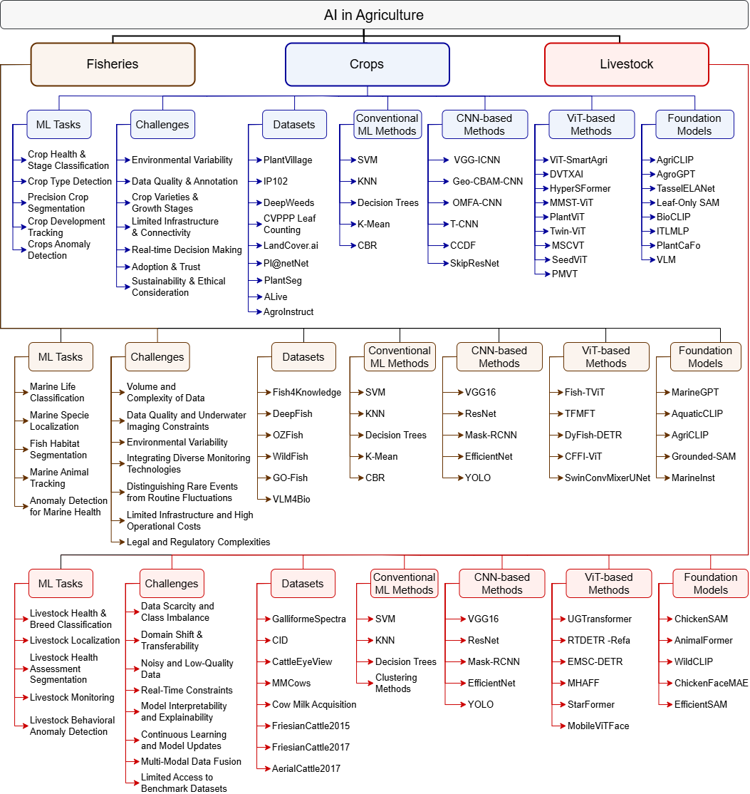

# AI in Agriculture — Survey Companion Repository

[](https://opensource.org/licenses/MIT)  [](https://arxiv.org/pdf/2502.21321)  [](https://github.com/zzli2022/System2-Reasoning-LLM)
[]()

<p align="center">
    
</p>

#### [Umair Nawaz](https://scholar.google.com/citations?user=w7N4wSYAAAAJ&hl=en), [Muhammad Zaigham Zaheer](https://scholar.google.com/citations?user=nFxWrXEAAAAJ&hl=en), [Fahad Shahbaz Khan](https://sites.google.com/view/fahadkhans/home), [Hisham Cholakkal](https://scholar.google.com/citations?user=bZ3YBRcAAAAJ&hl=en), [Salman Khan](https://salman-h-khan.github.io/), [Rao M. Anwer](https://scholar.google.fi/citations?user=_KlvMVoAAAAJ&hl=en)


## 1 What is this repository?
This repository complements our survey paper, **“AI in Agriculture: A Survey of Deep Learning Techniques for Crops, Fisheries and Livestock”**, which is a comprehensive review of machine- and deep-learning techniques for crops, livestock and fisheries.

It provides readers with:
- a curated index of **170 + referenced papers** (CSV & BibTeX);
- interactive notebooks reproducing **all tables and figures** from the manuscript;
- high-resolution artwork (taxonomy diagrams, dataset examples, etc.);
- lightweight helper scripts for updating the bibliography and statistics;
- guidelines for contributing new references once the survey is published.  


The goal is to make it effortless for researchers, practitioners and students to navigate the literature, replicate our analyses and extend the survey as the field evolves.

## 2 Paper at a glance

| Highlight | Details |
|-----------|---------|
| **Domains covered** | Crops, Livestock, Fisheries |
| **Techniques reviewed** | Conventional ML, CNNs, Vision Transformers, Vision-Language & Foundation Models |
| **Key themes** | Datasets & Benchmarks · Task Taxonomy · Implementation Challenges · Future Directions |
| **Total Papers Covered** | 170+ peer-reviewed papers and preprints |
| **Journal / venue** | *Pre-print*, under submission |

Feel free to ⭐ star and fork this repository to keep up with the latest advancements and contribute to the community.

---
<p align="center">
  
<!--    -->
</p>
A taxonomy of AI applications in *agriculture* divided into three domains: *crops*, *livestock*, and *fisheries*. We highlight various ML tasks for each domain along with the domain-specific challenges. Furthermore, a detailed overview of common datasets in each domain is specified, along with different approaches used, ranging from conventional ML methods to foundation models.
---

## 📌 Contents  

| Section | Subsection |  
| --------------------- | ----------- |  
| [📖 Introduction](#papers) | [Motivation & Scope](#survey), [Contributions](#theory), [Organization](#explainability) |  
| [🌾 AI for Crops](#Crops) | Machine Learning Tasks, Challenges, Key Crop Datasets  |  
| [⚙️ ML Techniques in Crops](#reward-learning) | [Conventional Approaches](#human-feedback), [CNNs](#preference-based-rl), [ViTs](#intrinsic-motivation), [Foundation Models]() |  
| [🐟 AI for Fisheries](#Fisheries) | Machine Learning Tasks, Challenges, Key Crop Datasets  |  
| [🎣 ML Techniques in Crops](#reward-learning) | [Conventional Approaches](#human-feedback), [CNNs](#preference-based-rl), [ViTs](#intrinsic-motivation), [Foundation Models]() |  
| [🐄 AI for Livestock](#Livestock) | Machine Learning Tasks, Challenges, Key Crop Datasets  |  
| [🛠️ ML Techniques in Livestock](#reward-learning) | [Conventional Approaches](#human-feedback), [CNNs](#preference-based-rl), [ViTs](#intrinsic-motivation), [Foundation Models]() |  
| [🌐 Cross-cutting Challenges & Opportunities](#Livestock) | Data Variability & Standardization, Model Transferability & Generalization, Resource Constraints & Edge Deployment, Explainability & Trustworthiness |  
| [🚀 Future Research Directions](#future-directions) | [Unifying Multi-modal Foundation Models](#human-feedback), [Continual and Federated Adaptation](#preference-based-rl), [Edge-Efficient AI for Real-time Decision Support](#intrinsic-motivation), [Agentic AI for Autonomous Farming]() |  
| [💡 Any other Suggestions](#tutorials-and-courses) | [Lectures](#lectures), [Workshops](#workshops) |  
| [🔗 Other Resources](#other-resources) | Additional Research & Readings |  

---
# 📖 Papers  

## 🔍 Survey  


# To be Removed as per the Progress.


# 📖 Papers  

## 🔍 Survey  

| Title | Publication Date | Link |
|---------------------------------|----------------|---------------------------------|
| A Survey on Bridging VLMs and Synthetic Data | 16 May 2025 | [OpenReview](https://openreview.net/pdf?id=ThjDCZOljE) |
| A Survey on Post-training of Large Language Models | 8 Mar 2025 | [Arxiv](https://arxiv.org/abs/2503.06072) |
| LLM Post-Training: A Deep Dive into Reasoning Large Language Models | 28 Feb 2025 | [Arxiv](https://arxiv.org/pdf/2502.21321) |
| From System 1 to System 2: A Survey of Reasoning Large Language Models | 25 Feb 2025 | [Arxiv](https://arxiv.org/abs/2502.17419) |
| Empowering LLMs with Logical Reasoning: A Comprehensive Survey | 24 Feb 2025 | [Arxiv](https://arxiv.org/pdf/2502.15652)|
| Towards Large Reasoning Models: A Survey of Reinforced Reasoning with Large Language Models | 16 Jan 2025 | [Arxiv](https://arxiv.org/abs/2501.09686) |
|Harmful Fine-tuning Attacks and Defenses for Large Language Models: A Survey   | 26 Sep 2024 | [Arxiv](https://arxiv.org/abs/2409.18169) |
| Reasoning with Large Language Models, a Survey | 16 July 2024 | [Arxiv](https://arxiv.org/abs/2407.11511) |
| Survey on Large Language Model-Enhanced Reinforcement Learning: Concept, Taxonomy, and Methods | 30 Mar 2024 | [Arxiv](https://arxiv.org/abs/2404.00282) |
| Reinforcement Learning Enhanced LLMs: A Survey | 5 Dec 2024 | [Arxiv](https://arxiv.org/abs/2412.10400) |
| Enhancing Code LLMs with Reinforcement Learning in Code Generation: A Survey | 29 Dec 2024 | [Arxiv](https://arxiv.org/abs/2412.20367) |
| Large Language Models: A Survey of Their Development, Capabilities, and Applications | 15 Jan 2025 | [Springer](https://link.springer.com/article/10.1007/s10115-024-02310-4) |
| A Survey on Multimodal Large Language Models | 10 Feb 2025 | [Oxford Academic](https://academic.oup.com/nsr/article/11/12/nwae403/7896414) |
| Large Language Models (LLMs): Survey, Technical Frameworks, and Future Directions | 20 Jul 2024 | [Springer](https://link.springer.com/article/10.1007/s10462-024-10888-y) |
| Using Large Language Models to Automate and Expedite Reinforcement Learning with Reward Machines | 11 Feb 2024 | [Arxiv](https://arxiv.org/abs/2402.07069) |
| ExploRLLM: Guiding Exploration in Reinforcement Learning with Large Language Models | 14 Mar 2024 | [Arxiv](https://arxiv.org/abs/2403.09583) |
| Reinforcement Learning Problem Solving with Large Language Models | 29 Apr 2024 | [Arxiv](https://arxiv.org/abs/2404.18638) |
| A Survey on Large Language Models for Reinforcement Learning | 10 Dec 2023 | [Arxiv](https://arxiv.org/abs/2312.04567) |
| Large Language Models as Decision-Makers: A Survey | 23 Aug 2023 | [Arxiv](https://arxiv.org/abs/2308.11749) |
| A Survey on Large Language Model Alignment Techniques | 6 May 2023 | [Arxiv](https://arxiv.org/abs/2305.00921) |
| Reinforcement Learning with Human Feedback: A Survey | 12 April 2023 | [Arxiv](https://arxiv.org/abs/2304.04989) |
| Reasoning with Large Language Models: A Survey | 14 Feb 2023 | [Arxiv](https://arxiv.org/abs/2302.06476) |
| A Survey on Foundation Models for Decision Making | 9 Jan 2023 | [Arxiv](https://arxiv.org/abs/2301.04150) |
| Large Language Models in Reinforcement Learning: Opportunities and Challenges | 5 Dec 2022 | [Arxiv](https://arxiv.org/abs/2212.09142) |
| Training language models to follow instructions with human feedback | 4 Mar 2022 | [Arxiv](https://arxiv.org/abs/2203.02155) |


---

## 🤖 LLMs-in-RL  

* Satori: Reinforcement Learning with Chain-of-Action-Thought Enhances LLM Reasoning via Autoregressive Search [[Paper]](https://arxiv.org/abs/2502.02508) 
* DeepScaleR: Surpassing O1-Preview with a 1.5B Model by Scaling RL [[Paper]](https://pretty-radio-b75.notion.site/DeepScaleR-Surpassing-O1-Preview-with-a-1-5B-Model-by-Scaling-RL-19681902c1468005bed8ca303013a4e2) 
* QLASS: Boosting Language Agent Inference via Q-Guided Stepwise Search [[Paper]](https://arxiv.org/abs/2502.02584) 
* Process Reinforcement through Implicit Rewards [[Paper]](https://arxiv.org/abs/2502.01456) 
* Advancing Language Model Reasoning through Reinforcement Learning and Inference Scaling [[Paper]](https://arxiv.org/abs/2501.11651) 
* Challenges in Ensuring AI Safety in DeepSeek-R1 Models: The Shortcomings of Reinforcement Learning Strategies [[Paper]](https://arxiv.org/abs/2501.17030) 
* DeepSeek-R1: Incentivizing Reasoning Capability in LLMs via Reinforcement Learning [[Paper]](https://arxiv.org/abs/2501.12948) 
* Kimi k1.5: Scaling Reinforcement Learning with LLMs [[Paper]](https://arxiv.org/abs/2501.12599) 
* Does RLHF Scale? Exploring the Impacts From Data, Model, and Method [[Paper]](https://arxiv.org/abs/2412.06000) 
* Offline Reinforcement Learning for LLM Multi-Step Reasoning [[Paper]](https://arxiv.org/abs/2412.16145) 
* ReFT: Representation Finetuning for Language Models [[Paper]](https://aclanthology.org/2024.acl-long.410.pdf) 
* Deepseekmath: Pushing the limits of mathematical reasoning in open language models [[Paper]](https://arxiv.org/abs/2402.03300) 
* Reasoning with Reinforced Functional Token Tuning [[Paper]](https://arxiv.org/abs/2502.13389) 
* Value-Based Deep RL Scales Predictably [[Paper]](https://arxiv.org/abs/2502.04327) 
* InfAlign: Inference-aware language model alignment [[Paper]](https://arxiv.org/abs/2412.19792) 
* LIMR: Less is More for RL Scaling [[Paper]](https://arxiv.org/abs/2502.11886) 
* A Survey on Feedback-based Multi-step Reasoning for Large Language Models on Mathematics [[Paper]](https://arxiv.org/abs/2502.143) 
 

---

## 🏆 Reward Learning (Process Reward Models)

* PRMBench: A Fine-grained and Challenging Benchmark for Process-Level Reward Models. [[Paper]](https://arxiv.org/abs/2501.03124) 
* ReARTeR: Retrieval-Augmented Reasoning with Trustworthy Process Rewarding [[Paper]](https://arxiv.org/abs/2501.07861) 
* The Lessons of Developing Process Reward Models in Mathematical Reasoning. [[Paper]](https://arxiv.org/abs/2501.07301) 
* ToolComp: A Multi-Tool Reasoning & Process Supervision Benchmark. [[Paper]](https://arxiv.org/abs/2501.01290) 
* AutoPSV: Automated Process-Supervised Verifier [[Paper]](https://openreview.net/forum?id=eOAPWWOGs9) 
* ReST-MCTS*: LLM Self-Training via Process Reward Guided Tree Search [[Paper]](https://openreview.net/forum?id=8rcFOqEud5) 
* Free Process Rewards without Process Labels. [[Paper]](https://arxiv.org/abs/2412.01981) 
* Outcome-Refining Process Supervision for Code Generation [[Paper]](https://arxiv.org/abs/2412.15118) 
* Math-Shepherd: Verify and Reinforce LLMs Step-by-step without Human Annotations [[Paper]](https://aclanthology.org/2024.acl-long.510/) 
* OVM: Outcome-supervised Value Models for Planning in Mathematical Reasoning [[Paper]](https://aclanthology.org/2024.findings-naacl.55/) 
* Step-DPO: Step-wise Preference Optimization for Long-chain Reasoning of LLMs [[Paper]](https://arxiv.org/abs/2406.18629) 
* Let's Verify Step by Step. [[Paper]](https://arxiv.org/abs/2305.20050) 
* Improve Mathematical Reasoning in Language Models by Automated Process Supervision [[Paper]](https://arxiv.org/abs/2306.05372) 
* Making Large Language Models Better Reasoners with Step-Aware Verifier [[Paper]](https://arxiv.org/abs/2206.02336) 
* Solving Math Word Problems with Process and Outcome-Based Feedback [[Paper]](https://arxiv.org/abs/2211.14275) 
* Uncertainty-Aware Step-wise Verification with Generative Reward Models [[Paper]](https://arxiv.org/abs/2502.11250) 
* AdaptiveStep: Automatically Dividing Reasoning Step through Model Confidence [[Paper]](https://www.arxiv.org/abs/2502.13943) 
* Self-Consistency of the Internal Reward Models Improves Self-Rewarding Language Models [[Paper]](https://www.arxiv.org/abs/2502.08922) 
* Can 1B LLM Surpass 405B LLM? Rethinking Compute-Optimal Test-Time Scaling [[Paper]](https://arxiv.org/abs/2502.06703) 
* Agentic Reward Modeling: Integrating Human Preferences with Verifiable Correctness Signals for Reliable Reward Systems [[Paper]](https://arxiv.org/abs/2502.19328) 
* Guided by Gut: Efficient Test-Time Scaling with Reinforced Intrinsic Confidence [[Paper]](https://arxiv.org/abs/2505.20325) 
---
##  MCTS/Tree Search
* On the Convergence Rate of MCTS for the Optimal Value Estimation in Markov Decision Processes [[Paper]](https://ieeexplore.ieee.org/abstract/document/10870057/) 
* Search-o1: Agentic Search-Enhanced Large Reasoning Models [[Paper]](https://arxiv.org/abs/2501.05366) 
* rStar-Math: Small LLMs Can Master Math Reasoning with Self-Evolved Deep Thinking [[Paper]](https://arxiv.org/abs/2501.04519) 
* ReST-MCTS*: LLM Self-Training via Process Reward Guided Tree Search [[Paper]](https://arxiv.org/abs/2406.03816) 
* Forest-of-Thought: Scaling Test-Time Compute for Enhancing LLM Reasoning [[Paper]](https://arxiv.org/abs/2412.09078) 
* HuatuoGPT-o1, Towards Medical Complex Reasoning with LLMs [[Paper]](https://arxiv.org/abs/2412.18925) 
* Mulberry: Empowering MLLM with o1-like Reasoning and Reflection via Collective Monte Carlo Tree Search [[Paper]](https://arxiv.org/abs/2412.18319) 
* Proposing and solving olympiad geometry with guided tree search [[Paper]](https://arxiv.org/abs/2412.10673) 
* SPaR: Self-Play with Tree-Search Refinement to Improve Instruction-Following in Large Language Models [[Paper]](https://arxiv.org/abs/2412.11605) 
* Towards Intrinsic Self-Correction Enhancement in Monte Carlo Tree Search Boosted Reasoning via Iterative Preference Learning [[Paper]](https://arxiv.org/abs/2412.17397) 
* CodeTree: Agent-guided Tree Search for Code Generation with Large Language Models [[Paper]](https://arxiv.org/abs/2411.04329) 
* GPT-Guided Monte Carlo Tree Search for Symbolic Regression in Financial Fraud Detection [[Paper]](https://arxiv.org/abs/2411.04459) 
* MC-NEST -- Enhancing Mathematical Reasoning in Large Language Models with a Monte Carlo Nash Equilibrium Self-Refine Tree [[Paper]](https://arxiv.org/abs/2411.15645) 
* Marco-o1: Towards Open Reasoning Models for Open-Ended Solutions [[Paper]](https://arxiv.org/abs/2411.14405) 
* SRA-MCTS: Self-driven Reasoning Augmentation with Monte Carlo Tree Search for Code Generation [[Paper]](https://arxiv.org/abs/2411.11053) 
* Don’t throw away your value model! Generating more preferable text with Value-Guided Monte-Carlo Tree Search decoding [[Paper]](https://openreview.net/forum?id=kh9Zt2Ldmn#discussion) 
* AFlow: Automating Agentic Workflow Generation [[Paper]](https://arxiv.org/abs/2410.10762) 
* Interpretable Contrastive Monte Carlo Tree Search Reasoning [[Paper]](https://arxiv.org/abs/2410.01707) 
* LLaMA-Berry: Pairwise Optimization for O1-like Olympiad-Level Mathematical Reasoning [[Paper]](https://arxiv.org/abs/2410.02884) 
* Towards Self-Improvement of LLMs via MCTS: Leveraging Stepwise Knowledge with Curriculum Preference Learning [[Paper]](https://arxiv.org/abs/2410.06508) 
* TreeBoN: Enhancing Inference-Time Alignment with Speculative Tree-Search and Best-of-N Sampling [[Paper]](https://arxiv.org/abs/2410.16033) 
* Understanding When Tree of Thoughts Succeeds: Larger Models Excel in Generation, Not Discrimination [[Paper]](https://arxiv.org/abs/2410.17820) 
* RethinkMCTS: Refining Erroneous Thoughts in Monte Carlo Tree Search for Code Generation [[Paper]](https://arxiv.org/abs/2409.09584) 
* Strategist: Learning Strategic Skills by LLMs via Bi-Level Tree Search [[Paper]](https://arxiv.org/abs/2408.10635) 
* LiteSearch: Efficacious Tree Search for LLM [[Paper]](https://arxiv.org/abs/2407.00320) 
* Tree Search for Language Model Agents [[Paper]](https://arxiv.org/abs/2407.01476) 
* Uncertainty-Guided Optimization on Large Language Model Search Trees [[Paper]](https://arxiv.org/abs/2407.03951) 
* * Accessing GPT-4 level Mathematical Olympiad Solutions via Monte Carlo Tree Self-refine with LLaMa-3 8B [[Paper]](https://arxiv.org/abs/2406.07394) 
* Beyond A*: Better Planning with Transformers via Search Dynamics Bootstrapping [[Paper]](https://openreview.net/forum?id=rviGTsl0oy) 
* LLM Reasoners: New Evaluation, Library, and Analysis of Step-by-Step Reasoning with Large Language Models [[Paper]](https://openreview.net/forum?id=h1mvwbQiXR) 
* AlphaMath Almost Zero: process Supervision without process [[Paper]](https://arxiv.org/abs/2405.03553) 
* Generating Code World Models with Large Language Models Guided by Monte Carlo Tree Search [[Paper]](https://arxiv.org/abs/2405.15383) 
* MindStar: Enhancing Math Reasoning in Pre-trained LLMs at Inference Time [[Paper]](https://arxiv.org/abs/2405.16265) 
* Monte Carlo Tree Search Boosts Reasoning via Iterative Preference Learning [[Paper]](https://arxiv.org/abs/2405.00451) 
* Stream of Search (SoS): Learning to Search in Language [[Paper]](https://arxiv.org/abs/2404.03683) 
* Toward Self-Improvement of LLMs via Imagination, Searching, and Criticizing [[Paper]](https://arxiv.org/abs/2404.12253) 
* Uncertainty of Thoughts: Uncertainty-Aware Planning Enhances Information Seeking in Large Language Models [[Paper]](https://openreview.net/forum?id=CVpuVe1N22&noteId=aTI8PGpO47) 
* Reasoning with Language Model is Planning with World Model [[Paper]](https://aclanthology.org/2023.emnlp-main.507/) 
* Large Language Models as Commonsense Knowledge for Large-Scale Task Planning [[Paper]](https://proceedings.neurips.cc/paper_files/paper/2023/hash/65a39213d7d0e1eb5d192aa77e77eeb7-Abstract-Conference.html) 
* ALPHAZERO-LIKE TREE-SEARCH CAN GUIDE LARGE LANGUAGE MODEL DECODING AND TRAINING [[Paper]](https://openreview.net/forum?id=PJfc4x2jXY) 
* Alphazero-like Tree-Search can Guide Large Language Model Decoding and Training [[Paper]](https://openreview.net/forum?id=PJfc4x2jXY) 
* MAKING PPO EVEN BETTER: VALUE-GUIDED MONTE-CARLO TREE SEARCH DECODING [[Paper]](https://arxiv.org/abs/2309.15028) 
* Leveraging Constrained Monte Carlo Tree Search to Generate Reliable Long Chain-of-Thought for Mathematical Reasoning [[Paper]](https://arxiv.org/abs/2502.11169) 
* Hypothesis-Driven Theory-of-Mind Reasoning for Large Language Models [[Paper]](https://arxiv.org/abs/2502.11881) 
* Fine-grained Conversational Decoding via Isotropic and Proximal Search [[Paper]](https://aclanthology.org/2023.emnlp-main.5/) 
* Control-DAG: Constrained Decoding for Non-Autoregressive Directed Acyclic T5 using Weighted Finite State Automata [[Paper]](https://aclanthology.org/2024.naacl-short.42/) 
* Look-back Decoding for Open-Ended Text Generation [[Paper]](https://aclanthology.org/2023.emnlp-main.66/) 
* LeanProgress: Guiding Search for Neural Theorem Proving via Proof Progress Prediction [[Paper]](https://arxiv.org/abs/2502.17925) 

---

## Explainability
* Agents Thinking Fast and Slow: A Talker-Reasoner Architecture [[Paper]](https://openreview.net/forum?id=xPhcP6rbI4) 
* What Happened in LLMs Layers when Trained for Fast vs. Slow Thinking: A Gradient Perspective [[Paper]](https://arxiv.org/abs/2410.23743) 
* When a Language Model is Optimized for Reasoning, Does It Still Show Embers of Autoregression? An Analysis of OpenAI o1 [[Paper]](https://arxiv.org/abs/2410.01792) 
* The Impact of Reasoning Step Length on Large Language Models [[Paper]](https://arxiv.org/abs/2401.04925) 
* Distilling System 2 into System 1 [[Paper]](https://arxiv.org/abs/2407.06023) 
* System 2 Attention (is something you might need too) [[Paper]](https://arxiv.org/abs/2311.11829) 
* Towards System 2 Reasoning in LLMs: Learning How to Think With Meta Chain-of-Thought [[Paper]](https://arxiv.org/abs/2501.04682) 
* LlamaV-o1: Rethinking Step-by-step Visual Reasoning in LLMs [[Paper]](https://arxiv.org/abs/2501.06186) 
* Two Heads Are Better Than One: Dual-Model Verbal Reflection at Inference-Time [[Paper]](https://arxiv.org/abs/2502.19230) 
* Exploring Iterative Enhancement for Improving Learnersourced Multiple-Choice Question Explanations with Large Language Models [[Paper]](http://arxiv.org/abs/2309.10444) 
* AbductionRules: Training Transformers to Explain Unexpected Inputs [[Paper]](https://aclanthology.org/2022.findings-acl.19/) 
## Multimodal Agent related Slow-Fast System
* Diving into Self-Evolving Training for Multimodal Reasoning [[Paper]](https://arxiv.org/abs/2412.17451) 
* Visual Agents as Fast and Slow Thinkers [[Paper]](https://openreview.net/forum?id=ncCuiD3KJQ) 
* Virgo: A Preliminary Exploration on Reproducing o1-like MLLM [[Paper]](https://arxiv.org/abs/2501.01904) 
* Scaling Inference-Time Search With Vision Value Model for Improved Visual Comprehension [[Paper]](https://arxiv.org/pdf/2412.03704) 
* Slow Perception: Let's Perceive Geometric Figures Step-by-Step [[Paper]](https://arxiv.org/abs/2412.20631) 
* AtomThink: A Slow Thinking Framework for Multimodal Mathematical Reasoning [[Paper]](https://arxiv.org/abs/2411.11930) 
* LLaVA-o1: Let Vision Language Models Reason Step-by-Step [[Paper]](https://arxiv.org/abs/2411.10440) 
* Vision-Language Models Can Self-Improve Reasoning via Reflection [[Paper]](https://arxiv.org/abs/2411.00855) 
* I Think, Therefore I Diffuse: Enabling Multimodal In-Context Reasoning in Diffusion Models [[Paper]](https://arxiv.org/abs/2502.10458) 
* RAG-Gym: Optimizing Reasoning and Search Agents with Process Supervision [[Paper]](https://arxiv.org/abs/2502.13957) 
## Benchmark and Datasets
* PhyX: Does Your Model Have the "Wits" for Physical Reasoning? [[Paper]](https://arxiv.org/abs/2505.15929) 
* Big-Math: A Large-Scale, High-Quality Math Dataset for Reinforcement Learning in Language Models [[Paper]](https://arxiv.org/abs/2502.17387) 
* PRMBench: A Fine-grained and Challenging Benchmark for Process-Level Reward Models [[Paper]](https://arxiv.org/abs/2501.03124) 
* MR-Ben: A Meta-Reasoning Benchmark for Evaluating System-2 Thinking in LLMs [[Paper]](https://openreview.net/forum?id=GN2qbxZlni) 
* Do NOT Think That Much for 2+3=? On the Overthinking of o1-like LLMs [[Paper]](https://arxiv.org/abs/2412.21187) 
* A Preliminary Study of o1 in Medicine: Are We Closer to an AI Doctor? [[Paper]](https://arxiv.org/abs/2409.15277) 
* EquiBench: Benchmarking Code Reasoning Capabilities of Large Language Models via Equivalence Checking [[Paper]](https://arxiv.org/abs/2502.12466) 
* SuperGPQA: Scaling LLM Evaluation across 285 Graduate Disciplines [[Paper]](https://arxiv.org/abs/2502.14739) 
* Multimodal RewardBench: Holistic Evaluation of Reward Models for Vision Language Models [[Paper]](https://arxiv.org/abs/2502.14191) 
* FrontierMath: A Benchmark for Evaluating Advanced Mathematical Reasoning in AI [[Paper]](https://arxiv.org/abs/2411.04872) 
* Evaluation of OpenAI o1: Opportunities and Challenges of AGI [[Paper]](https://arxiv.org/abs/2409.18486) 
* MATH-Perturb: Benchmarking LLMs' Math Reasoning Abilities against Hard Perturbations [[Paper]](https://arxiv.org/abs/2502.06453) 
* LongReason: A Synthetic Long-Context Reasoning Benchmark via Context Expansion [[Paper]](https://arxiv.org/abs/2501.15089) 
* Humanity's Last Exam [[Paper]](https://arxiv.org/abs/2501.14249) 
* LR<sup>2</sup>Bench: Evaluating Long-chain Reflective Reasoning Capabilities of Large Language Models via Constraint Satisfaction Problems [[Paper]](https://arxiv.org/abs/2502.17848) 
* BIG-Bench Extra Hard [[Paper]](https://arxiv.org/abs/2502.19187) 
* Assessing and Enhancing the Robustness of Large Language Models with Task Structure Variations for Logical Reasoning [[Paper]](https://arxiv.org/abs/2310.09430) 
* Multi-Step Deductive Reasoning Over Natural Language: An Empirical Study on Out-of-Distribution Generalisation [[Paper]](https://arxiv.org/abs/2207.14000) 
* Large Language Models Are Not Strong Abstract Reasoners [[Paper]](https://arxiv.org/abs/2305.19555) 

## Reasoning and Safety
* Safety Tax: Safety Alignment Makes Your Large Reasoning Models Less Reasonable [[Paper]](https://arxiv.org/abs/2503.00555v1) 
* OverThink: Slowdown Attacks on Reasoning LLMs [[Paper]](https://arxiv.org/abs/2502.02542) 
* GuardReasoner: Towards Reasoning-based LLM Safeguards [[Paper]](https://arxiv.org/abs/2501.18492) 
* SafeChain: Safety of Language Models with Long Chain-of-Thought Reasoning Capabilities [[Paper]](https://arxiv.org/abs/2502.12025) 
* ThinkGuard: Deliberative Slow Thinking Leads to Cautious Guardrails [[Paper]](https://arxiv.org/abs/2502.13458) 
* SafeChain: Safety of Language Models with Long Chain-of-Thought Reasoning Capabilities [[Paper]](https://arxiv.org/abs/2502.12025) 
* H-CoT: Hijacking the Chain-of-Thought Safety Reasoning Mechanism to Jailbreak Large Reasoning Models, Including OpenAI o1/o3, DeepSeek-R1, and Gemini 2.0 Flash Thinking [[Paper]](https://arxiv.org/abs/2502.12893) 
* BoT: Breaking Long Thought Processes of o1-like Large Language Models through Backdoor Attack [[Paper]](https://arxiv.org/abs/2502.12202) 
* Abstract Meaning Representation-Based Logic-Driven Data Augmentation for Logical Reasoning [[Paper]](https://aclanthology.org/2024.findings-acl.353/) 
* ChatLogic: Integrating Logic Programming with Large Language Models for Multi-step Reasoning [[Paper]](https://openreview.net/forum?id=AOqGF7Po7Z) 

---
## 🚀 RL & LLM Fine-Tuning Repositories

| #  | Repository & Link                                                                                          | Description                                                                                                                                                                                                                                                                                                                                                                                                                                                                                                                  |
|----|------------------------------------------------------------------------------------------------------------|------------------------------------------------------------------------------------------------------------------------------------------------------------------------------------------------------------------------------------------------------------------------------------------------------------------------------------------------------------------------------------------------------------------------------------------------------------------------------------------------------------------------------|
| 1  | [**RL4VLM**](https://github.com/RL4VLM/RL4VLM) <br><br> _Archived & Read-Only as of December 15, 2024_       | Offers code for fine-tuning large vision-language models as decision-making agents via RL. Includes implementations for training models with task-specific rewards and evaluating them in various environments.                                                                                                                                                                                                                                                                                                         |
| 2  | [**LlamaGym**](https://github.com/KhoomeiK/LlamaGym)                                                      | Simplifies fine-tuning large language model (LLM) agents with online RL. Provides an abstract `Agent` class to handle various aspects of RL training, allowing for quick iteration and experimentation across different environments.                                                                                                                                                                                                                                                                                      |
| 3  | [**RL-Based Fine-Tuning of Diffusion Models for Biological Sequences**](https://github.com/masa-ue/RLfinetuning_Diffusion_Bioseq) | Accompanies a tutorial and review paper on RL-based fine-tuning, focusing on the design of biological sequences (DNA/RNA). Provides comprehensive tutorials and code implementations for training and fine-tuning diffusion models using RL.                                                                                                                                                                                                                                     |
| 4  | [**LM-RL-Finetune**](https://github.com/zhixuan-lin/LM-RL-finetune)                                       | Aims to improve KL penalty optimization in RL fine-tuning of language models by computing the KL penalty term analytically. Includes configurations for training with Proximal Policy Optimization (PPO).                                                                                                                                                                                                                                                                                                                     |
| 5  | [**InstructLLaMA**](https://github.com/michaelnny/InstructLLaMA)                                           | Implements pre-training, supervised fine-tuning (SFT), and reinforcement learning from human feedback (RLHF) to train and fine-tune the LLaMA2 model to follow human instructions, similar to InstructGPT or ChatGPT.                                                                                                                                                                                                                                                                                                       |
| 6  | [**SEIKO**](https://github.com/zhaoyl18/SEIKO)                                                             | Introduces a novel RL method to efficiently fine-tune diffusion models in an online setting. Its techniques outperform baselines such as PPO, classifier-based guidance, and direct reward backpropagation for fine-tuning Stable Diffusion.                                                                                                                                                                                                                                                                              |
| 7  | [**TRL (Train Transformer Language Models with RL)**](https://github.com/huggingface/trl)                  | A state-of-the-art library for post-training foundation models using methods like Supervised Fine-Tuning (SFT), Proximal Policy Optimization (PPO), GRPO, and Direct Preference Optimization (DPO). Built on the 🤗 Transformers ecosystem, it supports multiple model architectures and scales efficiently across hardware setups.                                                                                                                                                                                     |
| 8  | [**Fine-Tuning Reinforcement Learning Models as Continual Learning**](https://github.com/BartekCupial/finetuning-RL-as-CL) | Explores fine-tuning RL models as a forgetting mitigation problem (continual learning). Provides insights and code implementations to address forgetting in RL models.                                                                                                                                                                                                                                                                                                                                                        |
| 9  | [**RL4LMs**](https://github.com/allenai/RL4LMs)                                                            | A modular RL library to fine-tune language models to human preferences. Rigorously evaluated through 2000+ experiments using the GRUE benchmark, ensuring robustness across various NLP tasks.                                                                                                                                                                                                                                                                                                                             |
| 10 | [**Lamorel**](https://github.com/flowersteam/lamorel)                                                      | A high-throughput, distributed architecture for seamless LLM integration in interactive environments. While not specialized in RL or RLHF by default, it supports custom implementations and is ideal for users needing maximum flexibility.                                                                                                                     |
| 11 | [**LLM-Reverse-Curriculum-RL**](https://github.com/WooooDyy/LLM-Reverse-Curriculum-RL)                     | Implements the ICML 2024 paper *"Training Large Language Models for Reasoning through Reverse Curriculum Reinforcement Learning"*. Focuses on enhancing LLM reasoning capabilities using a reverse curriculum RL approach.                                                                                                                                                                                                                                                  |
| 12 | [**veRL**](https://github.com/volcengine/verl)                                                             | A flexible, efficient, and production-ready RL training library for large language models (LLMs). Serves as the open-source implementation of the HybridFlow framework and supports various RL algorithms (PPO, GRPO), advanced resource utilization, and scalability up to 70B models on hundreds of GPUs. Integrates with Hugging Face models, supervised fine-tuning, and RLHF with multiple reward types.                                                  |
| 13 | [**trlX**](https://github.com/CarperAI/trlx)                                                               | A distributed training framework for fine-tuning large language models (LLMs) with reinforcement learning. Supports both Accelerate and NVIDIA NeMo backends, allowing training of models up to 20B+ parameters. Implements PPO and ILQL, and integrates with CHEESE for human-in-the-loop data collection.                                                                                                                                                                                              |
| 14 | [**Okapi**](https://github.com/nlp-uoregon/Okapi)                                                          | A framework for instruction tuning in LLMs with RLHF, supporting 26 languages. Provides multilingual resources such as ChatGPT prompts, instruction datasets, and response ranking data, along with both BLOOM-based and LLaMa-based models and evaluation benchmarks.                                                                                                                                                                                                                                                 |
| 15 | [**LLaMA-Factory**](https://github.com/hiyouga/LLaMA-Factory)                                              | *Unified Efficient Fine-Tuning of 100+ LLMs & VLMs (ACL 2024)*. Supports a wide array of models (e.g., LLaMA, LLaVA, Qwen, Mistral) with methods including pre-training, multimodal fine-tuning, reward modeling, PPO, DPO, and ORPO. Offers scalable tuning (16-bit, LoRA, QLoRA) with advanced optimizations and logging integrations, and provides fast inference via API, Gradio UI, and CLI with vLLM workers.                                                 |

---
## ⚡ Applications & Benchmarks  

- **"AutoGPT: LLMs for Autonomous RL Agents"** - OpenAI (2023) [[Paper](https://arxiv.org/abs/2304.03442)]  
- **"Barkour: Benchmarking LLM-Augmented RL"** - Wu et al. (2023) [[Paper](https://arxiv.org/abs/2305.12377)]  
* Big-Math: A Large-Scale, High-Quality Math Dataset for Reinforcement Learning in Language Models [[Paper]](https://arxiv.org/abs/2502.17387) 
* PRMBench: A Fine-grained and Challenging Benchmark for Process-Level Reward Models [[Paper]](https://arxiv.org/abs/2501.03124) 
* MR-Ben: A Meta-Reasoning Benchmark for Evaluating System-2 Thinking in LLMs [[Paper]](https://openreview.net/forum?id=GN2qbxZlni) 
* Do NOT Think That Much for 2+3=? On the Overthinking of o1-like LLMs [[Paper]](https://arxiv.org/abs/2412.21187) 
* A Preliminary Study of o1 in Medicine: Are We Closer to an AI Doctor? [[Paper]](https://arxiv.org/abs/2409.15277) 
* EquiBench: Benchmarking Code Reasoning Capabilities of Large Language Models via Equivalence Checking [[Paper]](https://arxiv.org/abs/2502.12466) 
* SuperGPQA: Scaling LLM Evaluation across 285 Graduate Disciplines [[Paper]](https://arxiv.org/abs/2502.14739) 
* Multimodal RewardBench: Holistic Evaluation of Reward Models for Vision Language Models [[Paper]](https://arxiv.org/abs/2502.14191) 
* FrontierMath: A Benchmark for Evaluating Advanced Mathematical Reasoning in AI [[Paper]](https://arxiv.org/abs/2411.04872) 
* Evaluation of OpenAI o1: Opportunities and Challenges of AGI [[Paper]](https://arxiv.org/abs/2409.18486) 
* MATH-Perturb: Benchmarking LLMs' Math Reasoning Abilities against Hard Perturbations [[Paper]](https://arxiv.org/abs/2502.06453) 
* LongReason: A Synthetic Long-Context Reasoning Benchmark via Context Expansion [[Paper]](https://arxiv.org/abs/2501.15089) 
* Humanity's Last Exam [[Paper]](https://arxiv.org/abs/2501.14249) 
* LR<sup>2</sup>Bench: Evaluating Long-chain Reflective Reasoning Capabilities of Large Language Models via Constraint Satisfaction Problems [[Paper]](https://arxiv.org/abs/2502.17848) 
* BIG-Bench Extra Hard [[Paper]](https://arxiv.org/abs/2502.19187) 

---

## 📚 Tutorials & Courses  

- 🎥 **Deep RL Bootcamp (Berkeley)** [[Website](https://sites.google.com/view/deep-rl-bootcamp/)]  
- 🎥 **DeepMind RL Series** [[Website](https://deepmind.com/learning-resources)]  

---

## 🛠️ Libraries & Implementations  

- 🔹 [Decision Transformer (GitHub)](https://github.com/kzl/decision-transformer)  
- 🔹 [ReAct (GitHub)](https://github.com/ysymyth/ReAct)  
- 🔹 [RLHF (GitHub)](https://github.com/openai/lm-human-preferences)  

---

## 🔗 Other Resources  

- [LLM for RL Workshop at NeurIPS 2023](https://neurips.cc)  
- [OpenAI Research Blog on RLHF](https://openai.com/research)  

---

## 📌 Contributing  

Contributions are welcome! If you have relevant papers, code, or insights, feel free to submit a pull request.  

[](https://www.star-history.com/#mbzuai-oryx/Awesome-LLM-Post-training&Timeline)

## Citation

If you find our work useful or use it in your research, please consider citing:

```bibtex
@misc{kumar2025llmposttrainingdeepdive,
      title={LLM Post-Training: A Deep Dive into Reasoning Large Language Models}, 
      author={Komal Kumar and Tajamul Ashraf and Omkar Thawakar and Rao Muhammad Anwer and Hisham Cholakkal and Mubarak Shah and Ming-Hsuan Yang and Phillip H. S. Torr and Fahad Shahbaz Khan and Salman Khan},
      year={2025},
      eprint={2502.21321},
      archivePrefix={arXiv},
      primaryClass={cs.CL},
      url={https://arxiv.org/abs/2502.21321}, 
}
```

## License :scroll:
<a rel="license" href="http://creativecommons.org/licenses/by-nc-sa/4.0/"></a><br />This work is licensed under a <a rel="license" href="http://creativecommons.org/licenses/by-nc-sa/4.0/">Creative Commons Attribution-NonCommercial-ShareAlike 4.0 International License</a>.


Looking forward to your feedback, contributions, and stars! :star2:
Please raise any issues or questions [here](https://github.com/mbzuai-oryx/Awesome-LLM-Post-training/issues). 


---
[](https://www.ival-mbzuai.com)
[](https://github.com/mbzuai-oryx)
[](https://mbzuai.ac.ae)