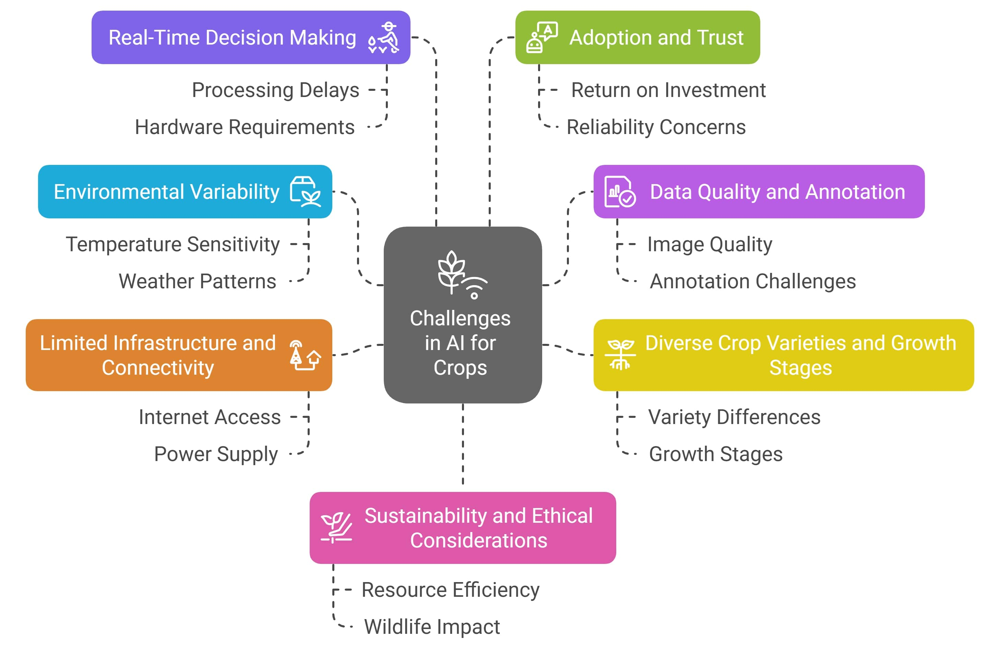

# AI in Agriculture — Survey Companion Repository

[](https://opensource.org/licenses/MIT)  [](TBA)  [](https://github.com/zzli2022/System2-Reasoning-LLM)
[]()

<p align="center">
    
</p>

#### [Umair Nawaz](https://scholar.google.com/citations?user=w7N4wSYAAAAJ&hl=en), [Muhammad Zaigham Zaheer](https://scholar.google.com/citations?user=nFxWrXEAAAAJ&hl=en), [Fahad Shahbaz Khan](https://sites.google.com/view/fahadkhans/home), [Hisham Cholakkal](https://scholar.google.com/citations?user=bZ3YBRcAAAAJ&hl=en), [Salman Khan](https://salman-h-khan.github.io/), [Rao M. Anwer](https://scholar.google.fi/citations?user=_KlvMVoAAAAJ&hl=en)


## 1 What is this repository?
This repository complements our survey paper, **“AI in Agriculture: A Survey of Deep Learning Techniques for Crops, Fisheries and Livestock”**, which is a comprehensive review of machine- and deep-learning techniques for crops, livestock and fisheries.

It provides readers with:
- a curated index of **170 + referenced papers** (CSV & BibTeX);
- interactive notebooks reproducing **all tables and figures** from the manuscript;
- high-resolution artwork (taxonomy diagrams, dataset examples, etc.);
- lightweight helper scripts for updating the bibliography and statistics;
- guidelines for contributing new references once the survey is published.  


The goal is to make it effortless for researchers, practitioners and students to navigate the literature, replicate our analyses and extend the survey as the field evolves.

## 2 Paper at a glance

| Highlight | Details |
|-----------|---------|
| **Domains covered** | Crops, Livestock, Fisheries |
| **Techniques reviewed** | Conventional ML, CNNs, Vision Transformers, Vision-Language & Foundation Models |
| **Key themes** | Datasets & Benchmarks · Task Taxonomy · Implementation Challenges · Future Directions |
| **Total Papers Covered** | 170+ peer-reviewed papers and preprints |
| **Journal / venue** | *Pre-print*, under submission |

Feel free to ⭐ star and fork this repository to keep up with the latest advancements and contribute to the community.

---
<p align="center">
  
<!--    -->
</p>
A taxonomy of AI applications in *agriculture* divided into three domains: *crops*, *livestock*, and *fisheries*. We highlight various ML tasks for each domain along with the domain-specific challenges. Furthermore, a detailed overview of common datasets in each domain is specified, along with different approaches used, ranging from conventional ML methods to foundation models.
---

## 📌 Contents  

| Section | Subsection |  
| --------------------- | ----------- |  
| [📖 Introduction](#papers) | [Motivation & Scope](#survey), [Contributions](#theory), [Organization](#explainability) |  
| [🌾 AI for Crops](#Crops) | Machine Learning Tasks, Challenges, Key Crop Datasets  |  
| [⚙️ ML Techniques in Crops](#reward-learning) | [Conventional Approaches](#human-feedback), [CNNs](#preference-based-rl), [ViTs](#intrinsic-motivation), [Foundation Models]() |  
| [🐟 AI for Fisheries](#Fisheries) | Machine Learning Tasks, Challenges, Key Crop Datasets  |  
| [🎣 ML Techniques in Fisheries](#reward-learning) | [Conventional Approaches](#human-feedback), [CNNs](#preference-based-rl), [ViTs](#intrinsic-motivation), [Foundation Models]() |  
| [🐄 AI for Livestock](#Livestock) | Machine Learning Tasks, Challenges, Key Crop Datasets  |  
| [🛠️ ML Techniques in Livestock](#reward-learning) | [Conventional Approaches](#human-feedback), [CNNs](#preference-based-rl), [ViTs](#intrinsic-motivation), [Foundation Models]() |  
| [🌐 Cross-cutting Challenges & Opportunities](#Livestock) | Data Variability & Standardization, Model Transferability & Generalization, Resource Constraints & Edge Deployment, Explainability & Trustworthiness |  
| [🚀 Future Research Directions](#future-directions) | [Unifying Multi-modal Foundation Models](#human-feedback), [Continual and Federated Adaptation](#preference-based-rl), [Edge-Efficient AI for Real-time Decision Support](#intrinsic-motivation), [Agentic AI for Autonomous Farming]() |  
| [💡 Any other Suggestions](#tutorials-and-courses) | [Lectures](#lectures), [Workshops](#workshops) |  
| [🔗 Other Resources](#other-resources) | Additional Research & Readings |  

---
# 📖 Papers  

## 🔍 Survey  


| Title | Publication Date | Link |
|---------------------------------|----------------|---------------------------------|
| AI in Agriculture: A Survey of Deep Learning Techniques for Crops, Fisheries and Livestock  | TBA | [Arxiv](TBA)                                                                         |
| Fish tracking, counting, and behaviour analysis in digital aquaculture: a comprehensive survey | 07 Jan 2025 | [WILEY](https://onlinelibrary.wiley.com/doi/abs/10.1111/raq.13001) |
| A survey on deep learning in UAV imagery for precision agriculture and wild flora monitoring: Datasets, models and challenges | 29 Oct 2024 | [ScienceDirect](https://www.sciencedirect.com/science/article/pii/S2772375524002302) |
| Recent advances in Transformer technology for agriculture  | 11 Oct 2024  | [ScienceDirect](https://www.sciencedirect.com/science/article/pii/S0952197624015707) |
| A survey of data collaborative sensing methods for smart agriculture   | 28 Aug 2024  | [ScienceDirect](https://www.sciencedirect.com/science/article/pii/S2542660524002956) |
| A Survey of Deep Learning for Intelligent Feeding in Smart Fish Farming   | 03 May 2024   | [ACM](https://dl.acm.org/doi/10.1145/3653081.3653179)                                |
| Deep learning for smart fish farming: applications, opportunities and challenges  | 03 May 2024   | [Arxiv](https://arxiv.org/pdf/2004.11848)                                            |
| Machine Learning Applications in Agriculture: Current Trends, Challenges, and Future Perspectives  | 01 Dec 2023      | [MDPI](https://www.mdpi.com/2073-4395/13/12/2976)                                    |
| A Survey of Computer Vision Technologies in Urban and Controlled-environment Agriculture   | 27 Nov 2023      | [ACM](https://dl.acm.org/doi/10.1145/3626186)                                        |
| Applications of deep learning in fish habitat monitoring: A tutorial and survey   | 01 Oct 2023      | [ScienceDirect](https://www.sciencedirect.com/science/article/pii/S0957417423023436) |
| A review of deep learning techniques used in agriculture  | 18 July 2023     | [ScienceDirect](https://www.sciencedirect.com/science/article/pii/S1574954123002467) |
| A systematic literature review on deep learning applications for precision cattle farming       | 12 Jul 2021      | [ScienceDirect](https://www.sciencedirect.com/science/article/pii/S0168169921003306) |
| A systematic literature review on the use of machine learning in precision livestock farming       | 20 Oct 2020      | [ScienceDirect](https://www.sciencedirect.com/science/article/pii/S0168169920317099) |
| A Systematic Literature Review on the Use of Deep Learning in Precision Livestock Detection and Localization  | 20 Oct 2020      | [IEEE](https://ieeexplore.ieee.org/document/9844698)                                 |


## 🌾 AI for Crops

### Machine Learning Tasks

#### Crop Health and Stage Classification
* Leaf disease identification and classification using optimized deep learning [[Paper]](https://www.sciencedirect.com/science/article/pii/S266591742200277X)
* Progress in the application of cnn-based image classification and recognition in whole crop growth cycles [[Paper]](https://www.mdpi.com/2072-4292/15/12/2988)
* Flowerphenonet: Automated flower detection from multi-view image sequences using deep neural networks for temporal plant phenotyping analysis [[Paper]](https://www.mdpi.com/2072-4292/14/24/6252)
* Recognition of sunflower growth period based on deep learning from uav remote sensing images [[Paper]](https://link.springer.com/article/10.1007/s11119-023-09996-6)
* Defect detection in fruit and vegetables by using machine vision systems and image processing [[Paper]](https://link.springer.com/article/10.1007/s12393-022-09307-1)


#### Crop Type Detection
* Review of weed detection methods based on computer vision  [[Paper]](https://www.mdpi.com/1424-8220/21/11/3647)
* Early weed detection using image processing and machine learning techniques in an Australian chilli farm [[Paper]](https://www.mdpi.com/2077-0472/11/5/387)
* Advanced drone-based weed detection using feature-enriched deep learning approach [[Paper]](https://www.sciencedirect.com/science/article/pii/S0950705124012899)
* A relational approach to pesticide use: Farmers, herbicides, nutsedge, and the weedy path to pesticide use reduction objectives  [[Paper]](https://www.sciencedirect.com/science/article/pii/S0743016723001122)
* Automated estimation of crop yield using artificial intelligence and remote sensing technologies  [[Paper]](https://www.mdpi.com/2306-5354/10/2/125)
* Recognition of bloom/yield in crop images using deep learning models for smart agriculture: A review  [[Paper]](https://www.mdpi.com/2073-4395/11/4/646)
* A smartphone-based application for scale pest detection using multiple-object detection methods  [[Paper]](https://www.mdpi.com/2079-9292/10/4/372)
* Pesticide spraying robot for precision agriculture: A categorical literature review and future trends  [[Paper]](https://onlinelibrary.wiley.com/doi/full/10.1002/rob.22043)


#### Precision Crop Segmentation
* Deep learning-based weed–crop recognition for smart agricultural equipment: A review  [[Paper]](https://www.mdpi.com/2073-4395/14/2/363)
* Towards the characterization of crop and weeds at leaf scale: A large comparison of shape, spatial and textural features  [[Paper]](https://www.sciencedirect.com/science/article/pii/S2772375523000758)
* Comparison of aerial and ground 3D point clouds for canopy size assessment in precision viticulture  [[Paper]](https://www.mdpi.com/2072-4292/14/5/1145)
* Nutrient stress symptom detection in cucumber seedlings using segmented regression and a mask region-based convolutional neural network model  [[Paper]](https://www.mdpi.com/2077-0472/14/8/1390)
* Using deep convolutional neural network for image-based diagnosis of nutrient deficiencies in plants grown in aquaponics  [[Paper]](https://www.mdpi.com/2227-9040/10/2/45)


#### Crop Development Tracking
* Plant disease detection by imaging sensors–parallels and specific demands for precision agriculture and plant phenotyping  [[Paper]](https://apsjournals.apsnet.org/doi/full/10.1094/PDIS-03-15-0340-FE)
* Soil sensors and plant wearables for smart and precision agriculture  [[Paper]](https://advanced.onlinelibrary.wiley.com/doi/abs/10.1002/adma.202007764)

#### Crops Anomaly Detection
* Machine learning for pest and disease detection in crops  [[Book]](https://www.taylorfrancis.com/chapters/edit/10.1201/9781003570219-6/machine-learning-pest-disease-detection-crops-durga-venkata-ravi-teja-amulothu-rahul-rodge-wajid-hasan-sheetanshu-gupta)
* Anomaly detection on data streams for smart agriculture  [[Paper]](https://www.mdpi.com/2077-0472/11/11/1083)


---
### Challenges in Crop Farming

<p align="center">
  
<!--    -->
</p>

### Key Crop Datasets

| Name | Source | Link |
|---------------------------------|----------------|---------------------------------|
| **PlantVillage** | Using deep learning for image-based plant disease detection | [Paper](https://doi.org/10.3389/fpls.2016.01419) |  
| **IP102** | Ip102: A large-scale benchmark dataset for insect pest recognition | [Paper](https://openaccess.thecvf.com/content_CVPR_2019/html/Wu_IP102_A_Large-Scale_Benchmark_Dataset_for_Insect_Pest_Recognition_CVPR_2019_paper.html)
| **DeepWeeds** | DeepWeeds: A multiclass weed species image dataset for deep learning | [Paper](https://www.nature.com/articles/s41598-018-38343-3)
| **CVPPP Leaf Counting** | Finely-grained annotated datasets for image-based plant phenotyping | [Paper](https://www.sciencedirect.com/science/article/pii/S0167865515003645)
| **LandCover.ai** | LandCover. ai: Dataset for automatic mapping of buildings, woodlands, water and roads from aerial imagery | [Paper](https://openaccess.thecvf.com/content/CVPR2021W/EarthVision/html/Boguszewski_LandCover.ai_Dataset_for_Automatic_Mapping_of_Buildings_Woodlands_Water_and_CVPRW_2021_paper.html)
| **Pl@ntNet** | Pl@ntNet-300K: a plant image dataset with high label ambiguity and a long-tailed distribution | [Paper](https://inria.hal.science/hal-03474556/)
| **PlantSeg** | Plantseg: A large-scale in-the-wild dataset for plant disease segmentation | [Paper](https://arxiv.org/abs/2409.04038)
| **ALive** | AgriCLIP: Adapting CLIP for agriculture and livestock via domain-specialized cross-model alignment | [Paper](https://arxiv.org/abs/2410.01407)
| **AgroInstruct** | Agrogpt: Efficient agricultural vision-language model with expert tuning | [Paper](https://ieeexplore.ieee.org/abstract/document/10944186)
| **CWFI** | A crop/weed field image dataset for the evaluation of computer vision based precision agriculture tasks | [Paper](https://link.springer.com/chapter/10.1007/978-3-319-16220-1_8)
| **Carrot Weed** | Weed detection dataset with RGB images taken under variable light conditions | [GitHub](https://github.com/lameski/rgbweeddetection)
| **Plant Seedlings** | Plant Seedlings Dataset | [link](https://vision.eng.au.dk/plant-seedlings-dataset/)
| **Grass-Broadleaf** | Weed Detection in Soybean Crops Using ConvNets | [Mendeley](https://data.mendeley.com/datasets/3fmjm7ncc6/2)
| **Sugar Beets 2016** | Sugar Beets Dataset | [link](https://www.ipb.uni-bonn.de/datasets_IJRR2017/annotations/)
| **WeedNet** | Multi-Spectral Dataset | [GitHub](https://github.com/inkyusa/weedNet)
| **Leaf Counting Dataset** | Dataset for Leaf Counting | [link](https://vision.eng.au.dk/leaf-counting-dataset/)
| **OPPD** | Open Plant Phenotyping Database | [link](https://gitlab.au.dk/AUENG-Vision/OPPD/-/tree/master/)
| **Deep Fruits** | Fruits Dataset | [link](https://drive.google.com/drive/folders/1CmsZb1caggLRN7ANfika8WuPiywo4mBb)
| **MangoNet** | The MangoNet Semantic Dataset | [GitHub](https://github.com/avadesh02/MangoNet-Semantic-Dataset)
| **MinneApple** | MinneApple: A Benchmark Dataset for Apple Detection and Segmentation | [link](https://doi.org/10.13020/8ecp-3r13)
| **PlantDoc** | PlantDoc: A Dataset for Visual Plant Disease Detection | [GitHub](https://github.com/pratikkayal/PlantDoc-Dataset)
| **Sugarcane Billets** | Dataset of sugarcane images | [GitHub](https://github.com/The77Lab/SugarcaneBilletsDataset)
| **DeepSeedling** | Deep Seedling Project Dataset | [link](https://figshare.com/s/616956f8633c17ceae9b)
| **GrassClover** | GrassClover dataset | [link](https://vision.eng.au.dk/grass-clover-dataset/)

---

## ⚙️ ML Techniques in Crops

### Conventional Approaches
* Support vector machines for crop classification using hyperspectral data [[Paper]](https://link.springer.com/chapter/10.1007/978-3-540-44871-6_16)
* Semi-supervised classification method for hyperspectral remote sensing images  [[Paper]](https://ieeexplore.ieee.org/document/1294247)
* CART-based feature selection of hyperspectral images for crop cover classification  [[Paper]](https://ieeexplore.ieee.org/abstract/document/1247313)
* An enhanced approach for crop yield prediction system using linear support vector machine model  [[Paper]](https://ieeexplore.ieee.org/abstract/document/9767994)
* Precision sugarcane monitoring using SVM classifier  [[Paper]](https://www.sciencedirect.com/science/article/pii/S1877050917326984)
* Crop Recommendation System Using K-Nearest Neighbors Algorithm  [[Paper]](https://link.springer.com/chapter/10.1007/978-981-33-4501-0_54)
* Precision agriculture crop recommendation system using knn algorithm  [[Paper]](https://ieeexplore.ieee.org/abstract/document/10263667)
* Detection and classification of groundnut leaf diseases using KNN classifier  [[Paper]](https://ieeexplore.ieee.org/abstract/document/8878733)
* Data-efficient crop pest recognition based on KNN distance entropy  [[Paper]](https://www.sciencedirect.com/science/article/pii/S221053792300015X)
* Cotton crop disease detection using decision tree classifier  [[Paper]](https://ieeexplore.ieee.org/abstract/document/8537336)
* The use of fuzzy decision trees for coffee rust warning in Brazilian crops  [[Paper]](https://ieeexplore.ieee.org/abstract/document/6121847)
* Validation and refinement of cropland data layer using a spatial-temporal decision tree algorithm  [[Paper]](https://www.nature.com/articles/s41597-022-01169-w)
* Application of the decision tree method for predicting the yield of spring wheat  [[Paper]](https://iopscience.iop.org/article/10.1088/1755-1315/839/3/032042/meta)
* Implementation of K-means algorithm for clustering corn planting feasibility area in south lampung regency  [[Paper]](https://iopscience.iop.org/article/10.1088/1742-6596/1751/1/012038/meta)
* Detection of healthy and defected diseased leaf of rice crop using K-means clustering technique  [[Paper]](https://www.researchgate.net/profile/Prabira-Sethy/publication/312494913_Detection_of_Healthy_and_Defected_Diseased_Leaf_of_Rice_Crop_using_K-Means_Clustering_Technique/links/587f198b08aed3826af46ed6/Detection-of-Healthy-and-Defected-Diseased-Leaf-of-Rice-Crop-using-K-Means-Clustering-Technique.pdf)
* Weed and crop detection by combining crop row detection and k-means clustering in weed infested agricultural fields  [[Paper]](https://ieeexplore.ieee.org/abstract/document/9708815)
* Research on Crop Planting Strategies Based on K-means Cluster Analysis and Linear Programming  [[Paper]](https://ieeexplore.ieee.org/abstract/document/10898646)
* Agricultural Remote Sensing with Case-Based Reasoning  [[Paper]](https://www.preprints.org/frontend/manuscript/0356b390c0af7bde55c02a30f6758997/download_pub)
* Development of a Fuzzy Case-Based Reasoning Decision Support System for Water Management in Smart Agriculture  [[Paper]](http://msesj.com:8092/index.php/mses/article/view/171)
* Applying case-based reasoning and a learning-based adaptation strategy to irrigation scheduling in grape farming  [[Paper]](https://www.sciencedirect.com/science/article/pii/S0168169920318664)
* Application of Case Based Reasoning Method to Diagnose Rice Plant Diseases  [[Paper]](https://ioinformatic.org/index.php/JAIEA/article/view/372)


### CNNs
* VGG-ICNN: A Lightweight CNN model for crop disease identification  [[Paper]](https://link.springer.com/article/10.1007/s11042-022-13144-z)
* Going deeper with convolutions  [[Paper]](https://www.cv-foundation.org/openaccess/content_cvpr_2015/html/Szegedy_Going_Deeper_With_2015_CVPR_paper.html)
* Efficientnet: Rethinking model scaling for convolutional neural networks  [[Paper]](https://proceedings.mlr.press/v97/tan19a.html?ref=ji)
* A new attention-based CNN approach for crop mapping using time series Sentinel-2 images  [[Paper]](https://www.sciencedirect.com/science/article/pii/S0168169921001083)
* Advanced Deep Learning Model for Multi-Disease Prediction in Potato Crops: A Precision Agriculture Approach  [[Paper]](https://ieeexplore.ieee.org/abstract/document/10625281)
* T-CNN: Trilinear convolutional neural networks model for visual detection of plant diseases  [[Paper]](https://www.sciencedirect.com/science/article/pii/S0168169921004853)
* CCDF: Automatic system for segmentation and recognition of fruit crops diseases based on correlation coefficient and deep CNN features  [[Paper]](https://www.sciencedirect.com/science/article/pii/S0168169918303120)
* Very deep convolutional networks for large-scale image recognition  [[Paper]](https://arxiv.org/abs/1409.1556)
* Imagenet classification with deep convolutional neural networks  [[Paper]](https://proceedings.neurips.cc/paper/2012/hash/c399862d3b9d6b76c8436e924a68c45b-Abstract.html)
* SkipResNet: Crop and Weed Recognition Based on the Improved ResNet  [[Paper]](https://www.mdpi.com/2073-445X/13/10/1585)
* Deep residual learning for image recognition  [[Paper]](https://openaccess.thecvf.com/content_cvpr_2016/html/He_Deep_Residual_Learning_CVPR_2016_paper.html)
* CustomBottleneck-VGGNet: Advanced tomato leaf disease identification for sustainable agriculture  [[Paper]](https://www.sciencedirect.com/science/article/pii/S0168169925001723)
* Fully convolutional network for rice seedling and weed image segmentation at the seedling stage in paddy fields  [[Paper]](https://journals.plos.org/plosone/article?id=10.1371/journal.pone.0215676)
* Real-time recognition system of soybean seed full-surface defects based on deep learning  [[Paper]](https://www.sciencedirect.com/science/article/pii/S0168169921002477)
* Insect-YOLO: A new method of crop insect detection  [[Paper]](https://www.sciencedirect.com/science/article/pii/S0168169925001917)


### ViTs
* ViT-SmartAgri: Vision Transformer and Smartphone-Based Plant Disease Detection for Smart Agriculture  [[Paper]](https://www.mdpi.com/2073-4395/14/2/327)
* An image is worth 16x16 words: Transformers for image recognition at scale  [[Paper]](https://arxiv.org/pdf/2010.11929/1000)
* DVTXAI: a novel deep vision transformer with an explainable AI-based framework and its application in agriculture  [[Paper]](https://link.springer.com/article/10.1007/s11227-024-06494-y)
* HyperSFormer: A transformer-based end-to-end hyperspectral image classification method for crop classification  [[Paper]](https://www.mdpi.com/2072-4292/15/14/3491)
* Swin transformer: Hierarchical vision transformer using shifted windows  [[Paper]](https://openaccess.thecvf.com/content/ICCV2021/html/Liu_Swin_Transformer_Hierarchical_Vision_Transformer_Using_Shifted_Windows_ICCV_2021_paper)
* Mmst-vit: Climate change-aware crop yield prediction via multi-modal spatial-temporal vision transformer  [[Paper]](https://openaccess.thecvf.com/content/ICCV2023/html/Lin_MMST-ViT_Climate_Change-aware_Crop_Yield_Prediction_via_Multi-Modal_Spatial-Temporal_Vision_ICCV_2023_paper.html)
* Vision Transformer for Plant Disease Detection: PlantViT  [[Paper]](https://link.springer.com/chapter/10.1007/978-3-031-11346-8_43)
* A novel twin vision transformer framework for crop disease classification with deformable attention  [[Paper]](https://www.sciencedirect.com/science/article/pii/S174680942500062X)
* Crop disease identification by fusing multiscale convolution and vision transformer  [[Paper]](https://www.mdpi.com/1424-8220/23/13/6015)
* A Vision Transformer network SeedViT for classification of maize seeds  [[Paper]](https://onlinelibrary.wiley.com/doi/abs/10.1111/jfpe.13998)
* PMVT: a lightweight vision transformer for plant disease identification on mobile devices  [[Paper]](https://www.frontiersin.org/journals/plant-science/articles/10.3389/fpls.2023.1256773/full)
* Effective plant disease diagnosis using Vision Transformer trained with leafy-generative adversarial network-generated images  [[Paper]](https://www.sciencedirect.com/science/article/pii/S0957417424012533)
* Visual intelligence in precision agriculture: Exploring plant disease detection via efficient vision transformers  [[Paper]](https://www.mdpi.com/1424-8220/23/15/6949)


### Foundation Models
* Visual large language model for wheat disease diagnosis in the wild  [[Paper]](https://www.sciencedirect.com/science/article/pii/S0168169924009785)
* Potato disease detection and prevention using multimodal AI and large language model  [[Paper]](https://www.sciencedirect.com/science/article/pii/S0168169924012158)
* AgriCLIP: Adapting CLIP for agriculture and livestock via domain-specialized cross-model alignment  [[Paper]](https://arxiv.org/abs/2410.01407)
* Agrogpt: Efficient agricultural vision-language model with expert tuning  [[Paper]](https://ieeexplore.ieee.org/abstract/document/10944186)
* Diffusionsat: A generative foundation model for satellite imagery  [[Paper]](https://arxiv.org/abs/2312.03606)
* Vision foundation model for agricultural applications with efficient layer aggregation network  [[Paper]](https://www.sciencedirect.com/science/article/pii/S0957417424018396)
* Leaf only SAM: A segment anything pipeline for zero-shot automated leaf segmentation  [[Paper]](https://www.sciencedirect.com/science/article/pii/S2772375524001205)
* Bioclip: A vision foundation model for the tree of life  [[Paper]](https://openaccess.thecvf.com/content/CVPR2024/html/Stevens_BioCLIP_A_Vision_Foundation_Model_for_the_Tree_of_Life_CVPR_2024_paper.html)
* Cucumber disease recognition with small samples using image-text-label-based multi-modal language model  [[Paper]](https://www.sciencedirect.com/science/article/pii/S0168169923003812)
* PlantCaFo: An efficient few-shot plant disease recognition method based on foundation models  [[Paper]](https://www.sciencedirect.com/science/article/pii/S2643651525000305)
* Learning transferable visual models from natural language supervision  [[Paper]](https://proceedings.mlr.press/v139/radford21a)
* Multi-label plant species classification with self-supervised vision transformers  [[Paper]](https://arxiv.org/abs/2407.06298)
* Visual information guided multi-modal model for plant disease anomaly detection  [[Paper]](https://www.sciencedirect.com/science/article/pii/S2772375524001734)

---

## 🎣 AI for Fisheries

### Machine Learning Tasks

#### Marine Life Classification

* Machine learning applications for fisheries—at scales from genomics to ecosystems  [[Paper]](https://www.tandfonline.com/doi/abs/10.1080/23308249.2024.2423189)
* Automatic counting methods in aquaculture: A review  [[Paper]](https://onlinelibrary.wiley.com/doi/full/10.1111/jwas.12745)
* Deep learning for smart fish farming: applications, opportunities and challenges  [[Paper]](https://onlinelibrary.wiley.com/doi/abs/10.1111/raq.12464)
* Applications of data mining and machine learning framework in aquaculture and fisheries: A review  [[Paper]](https://www.sciencedirect.com/science/article/pii/S2772375522000260)
* A review of deep learning-based stereo vision techniques for phenotype feature and behavioral analysis of fish in aquaculture  [[Paper]](https://link.springer.com/article/10.1007/s10462-024-10960-7)
* Advancing underwater vision: a survey of deep learning models for underwater object recognition and tracking  [[Paper]](https://ieeexplore.ieee.org/abstract/document/10852283/)
* Automatic labeling of fish species using deep learning across different classification strategies  [[Paper]](https://www.frontiersin.org/journals/computer-science/articles/10.3389/fcomp.2024.1326452/full)
* An optimized deep network-based fish tracking and classification from underwater images  [[Paper]](https://link.springer.com/article/10.1007/s11042-024-19417-z)
* Recent advances of deep learning algorithms for aquacultural machine vision systems with emphasis on fish  [[Paper]](https://link.springer.com/article/10.1007/s10462-021-10102-3)

#### Marine Specie Localization
* Automatic detection of fish and tracking of movement for ecology  [[Paper]](https://onlinelibrary.wiley.com/doi/full/10.1002/ece3.7656)
* Rethinking general underwater object detection: Datasets, challenges, and solutions  [[Paper]](https://www.sciencedirect.com/science/article/pii/S0925231222013169)
* Underwater object detection in the era of artificial intelligence: Current, challenge, and future  [[Paper]](https://arxiv.org/abs/2410.05577)
* Fish tracking, counting, and behaviour analysis in digital aquaculture: a comprehensive survey  [[Paper]](https://onlinelibrary.wiley.com/doi/abs/10.1111/raq.13001)
* DeepSeaNet: a bio-detection network enabling species identification in the deep sea imagery  [[Paper]](https://ieeexplore.ieee.org/abstract/document/10415449/)
* Deep learning for visual recognition and detection of aquatic animals: A review  [[Paper]](https://onlinelibrary.wiley.com/doi/abs/10.1111/raq.12726)
* Enhanced deep learning models for automatic fish species identification in underwater imagery  [[Paper]](https://www.cell.com/heliyon/fulltext/S2405-8440(24)11248-0)
* Advancing underwater vision: a survey of deep learning models for underwater object recognition and tracking  [[Paper]](https://ieeexplore.ieee.org/abstract/document/10852283)
* Fish face identification based on rotated object detection: dataset and exploration  [[Paper]](https://www.mdpi.com/2410-3888/7/5/219)
* Fe-det: An effective traffic object detection framework for fish-eye cameras  [[Paper]](https://openaccess.thecvf.com/content/CVPR2024W/AICity/html/Luo_FE-Det_An_Effective_Traffic_Object_Detection_Framework_for_Fish-Eye_Cameras_CVPRW_2024_paper.html)
* A novel automated approach for fish biomass estimation in turbid environments through deep learning, object detection, and regression  [[Paper]](https://www.sciencedirect.com/science/article/pii/S157495412400205X)
*   [[Paper]]()
*   [[Paper]]()

*   [[Paper]]()


#### 


### Challenges
- **Chen & Zhao (2021)** “Underwater Image Quality.” [link](#)

### Key Fisheries Datasets
- **Fish4Knowledge** (Sterling et al., 2014) – Annotated underwater videos. [link](#)

---

## ⚙️ ML Techniques in Fisheries

### Conventional Approaches
- **Wang et al. (2019)** “HOG+SVM for Fish Detection.” [link](#)

### CNNs
- **Hernandez & Morales (2020)** “3D CNNs for Behavior Analysis.” [link](#)

### ViTs
- **Zhao & Li (2022)** “ViTs in Aquatic Imaging.” [link](#)

### Foundation Models
- **Kim & Park (2023)** “Foundation Models for Underwater Vision.” [link](#)

---

## 🐄 AI for Livestock

### Machine Learning Tasks
- **Elahi et al. (2021)** “Sensor-based Cattle Health Monitoring.” [link](#)

### Challenges
- **Miller & Adams (2022)** “Heterogeneous Data in Animal Farms.” [link](#)

### Key Livestock Datasets
- **FarmTrack** (Zhou et al., 2020) – Sensor & video recordings. [link](#)

---

## ⚙️ ML Techniques in Livestock

### Conventional Approaches
- **Johnson & White (2019)** “Random Forests for Animal Behavior.” [link](#)

### CNNs
- **Li & Kumar (2021)** “CNNs for Pose Estimation in Livestock.” [link](#)

### ViTs
- **Patel et al. (2022)** “Vision Transformers for Animal Monitoring.” [link](#)

### Foundation Models
- **Sahni & Gupta (2023)** “Adapting Foundation Models to Livestock Data.” [link](#)

---

## 🌐 Cross-cutting Challenges & Opportunities

- **Data Variability & Standardization**  
  - Smith & Chen (2022) “Standardizing Agri-AI Datasets.” [link](#)

- **Model Transferability & Generalization**  
  - Nguyen & Lee (2021) “Domain Adaptation in Farming Models.” [link](#)

- **Resource Constraints & Edge Deployment**  
  - Patel et al. (2023) “TinyML for Smart Farms.” [link](#)

- **Explainability & Trustworthiness**  
  - Doe & Roe (2020) “Explainable AI in Agriculture.” [link](#)

---

## 🚀 Future Research Directions

1. **Unifying Multi-modal Foundation Models**  
   - Zhang & Wu (2023) “Multi-modal AI for Farm Robotics.” [link](#)

2. **Continual and Federated Adaptation**  
   - Fernandez et al. (2022) “Federated Learning in Agro-Sensors.” [link](#)

3. **Edge-Efficient AI for Real-time Decision Support**  
   - Khan et al. (2023) “Real-time Crop Monitoring on Microcontrollers.” [link](#)

4. **Agentic AI for Autonomous Farming**  
   - Lopez & Singh (2024) “Autonomous Robot Agents in Agriculture.” [link](#)

---

## 💡 Any other Suggestions

- **Lectures & Workshops**  
  - “AgriAI 2024 Workshop on Farm Robotics”  
  - “Precision Farming Summer School 2023”

---

## 🔗 Other Resources

- **Additional Research & Readings**  
  - FAO e-Agriculture Wiki: https://www.fao.org/e-agriculture  
  - AgriOpen Data Portal: https://agri.opendata.org  

---

## 📌 Contributing  

Contributions are welcome! If you have relevant papers, code, or insights, feel free to submit a pull request.  

<!-- [](https://www.star-history.com/#mbzuai-oryx/Awesome-LLM-Post-training&Timeline) -->

## Citation

If you find our work useful or use it in your research, please consider citing:

```bibtex
TBA
```

## License :scroll:
<a rel="license" href="http://creativecommons.org/licenses/by-nc-sa/4.0/"></a><br />This work is licensed under a <a rel="license" href="http://creativecommons.org/licenses/by-nc-sa/4.0/">Creative Commons Attribution-NonCommercial-ShareAlike 4.0 International License</a>.


Looking forward to your feedback, contributions, and stars! :star2:


