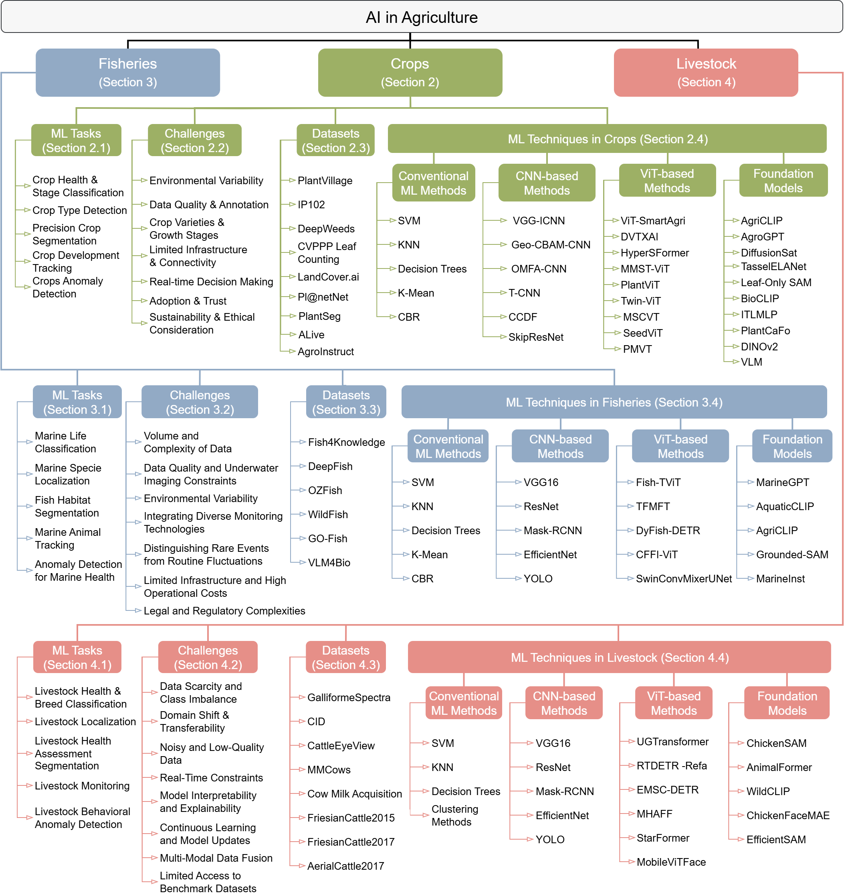

# AI in Agriculture — Survey Companion Repository

[](https://opensource.org/licenses/MIT)  [](TBA)  [](https://github.com/zzli2022/System2-Reasoning-LLM)
[]()

<p align="center">
    
</p>

#### [Umair Nawaz](https://scholar.google.com/citations?user=w7N4wSYAAAAJ&hl=en), [Muhammad Zaigham Zaheer](https://scholar.google.com/citations?user=nFxWrXEAAAAJ&hl=en), [Fahad Shahbaz Khan](https://sites.google.com/view/fahadkhans/home), [Hisham Cholakkal](https://scholar.google.com/citations?user=bZ3YBRcAAAAJ&hl=en), [Salman Khan](https://salman-h-khan.github.io/), [Rao M. Anwer](https://scholar.google.fi/citations?user=_KlvMVoAAAAJ&hl=en)


## 1 What is this repository?
This repository complements our survey paper, **“AI in Agriculture: A Survey of Deep Learning Techniques for Crops, Fisheries and Livestock”**, which is a comprehensive review of machine- and deep-learning techniques for crops, livestock and fisheries.

It provides readers with:
- a curated index of **170 + referenced papers** (CSV & BibTeX);
- interactive notebooks reproducing **all tables and figures** from the manuscript;
- high-resolution artwork (taxonomy diagrams, dataset examples, etc.);
- lightweight helper scripts for updating the bibliography and statistics;
- guidelines for contributing new references once the survey is published.  


The goal is to make it effortless for researchers, practitioners and students to navigate the literature, replicate our analyses and extend the survey as the field evolves.

## 2 Paper at a glance

| Highlight | Details |
|-----------|---------|
| **Domains covered** | Crops, Livestock, Fisheries |
| **Techniques reviewed** | Conventional ML, CNNs, Vision Transformers, Vision-Language & Foundation Models |
| **Key themes** | Datasets & Benchmarks · Task Taxonomy · Implementation Challenges · Future Directions |
| **Total Papers Covered** | 170+ peer-reviewed papers and preprints |
| **Journal / venue** | *Pre-print*, under submission |

Feel free to ⭐ star and fork this repository to keep up with the latest advancements and contribute to the community.

---
<p align="center">
  
<!--    -->
</p>
A taxonomy of AI applications in *agriculture* divided into three domains: *crops*, *livestock*, and *fisheries*. We highlight various ML tasks for each domain along with the domain-specific challenges. Furthermore, a detailed overview of common datasets in each domain is specified, along with different approaches used, ranging from conventional ML methods to foundation models.
---

## 📌 Contents  

| Section | Subsection |  
| --------------------- | ----------- |  
| [📖 Introduction](#papers) | [Motivation & Scope](#survey), [Contributions](#theory), [Organization](#explainability) |  
| [🌾 AI for Crops](#Crops) | Machine Learning Tasks, Challenges, Key Crop Datasets  |  
| [⚙️ ML Techniques in Crops](#reward-learning) | [Conventional Approaches](#human-feedback), [CNNs](#preference-based-rl), [ViTs](#intrinsic-motivation), [Foundation Models]() |  
| [🐟 AI for Fisheries](#Fisheries) | Machine Learning Tasks, Challenges, Key Crop Datasets  |  
| [🎣 ML Techniques in Fisheries](#reward-learning) | [Conventional Approaches](#human-feedback), [CNNs](#preference-based-rl), [ViTs](#intrinsic-motivation), [Foundation Models]() |  
| [🐄 AI for Livestock](#Livestock) | Machine Learning Tasks, Challenges, Key Crop Datasets  |  
| [🛠️ ML Techniques in Livestock](#reward-learning) | [Conventional Approaches](#human-feedback), [CNNs](#preference-based-rl), [ViTs](#intrinsic-motivation), [Foundation Models]() |  
| [🌐 Cross-cutting Challenges & Opportunities](#Livestock) | Data Variability & Standardization, Model Transferability & Generalization, Resource Constraints & Edge Deployment, Explainability & Trustworthiness |  
| [🚀 Future Research Directions](#future-directions) | [Unifying Multi-modal Foundation Models](#human-feedback), [Continual and Federated Adaptation](#preference-based-rl), [Edge-Efficient AI for Real-time Decision Support](#intrinsic-motivation), [Agentic AI for Autonomous Farming]() |  
| [💡 Any other Suggestions](#tutorials-and-courses) | [Lectures](#lectures), [Workshops](#workshops) |  
| [🔗 Other Resources](#other-resources) | Additional Research & Readings |  

---
# 📖 Papers  

## 🔍 Survey  


| Title | Publication Date | Link |
|---------------------------------|----------------|---------------------------------|
| AI in Agriculture: A Survey of Deep Learning Techniques for Crops, Fisheries and Livestock  | TBA | [Arxiv](TBA)                                                                         |
| A survey on deep learning in UAV imagery for precision agriculture and wild flora monitoring: Datasets, models and challenges | 29 Oct 2024 | [ScienceDirect](https://www.sciencedirect.com/science/article/pii/S2772375524002302) |
| Recent advances in Transformer technology for agriculture  | 11 Oct 2024  | [ScienceDirect](https://www.sciencedirect.com/science/article/pii/S0952197624015707) |
| A survey of data collaborative sensing methods for smart agriculture   | 28 Aug 2024  | [ScienceDirect](https://www.sciencedirect.com/science/article/pii/S2542660524002956) |
| A Survey of Deep Learning for Intelligent Feeding in Smart Fish Farming   | 03 May 2024   | [ACM](https://dl.acm.org/doi/10.1145/3653081.3653179)                                |
| Deep learning for smart fish farming: applications, opportunities and challenges  | 03 May 2024   | [Arxiv](https://arxiv.org/pdf/2004.11848)                                            |
| Machine Learning Applications in Agriculture: Current Trends, Challenges, and Future Perspectives  | 01 Dec 2023      | [MDPI](https://www.mdpi.com/2073-4395/13/12/2976)                                    |
| A Survey of Computer Vision Technologies in Urban and Controlled-environment Agriculture   | 27 Nov 2023      | [ACM](https://dl.acm.org/doi/10.1145/3626186)                                        |
| Applications of deep learning in fish habitat monitoring: A tutorial and survey   | 01 Oct 2023      | [ScienceDirect](https://www.sciencedirect.com/science/article/pii/S0957417423023436) |
| A review of deep learning techniques used in agriculture  | 18 July 2023     | [ScienceDirect](https://www.sciencedirect.com/science/article/pii/S1574954123002467) |
| A systematic literature review on deep learning applications for precision cattle farming       | 12 Jul 2021      | [ScienceDirect](https://www.sciencedirect.com/science/article/pii/S0168169921003306) |
| A systematic literature review on the use of machine learning in precision livestock farming       | 20 Oct 2020      | [ScienceDirect](https://www.sciencedirect.com/science/article/pii/S0168169920317099) |
| A Systematic Literature Review on the Use of Deep Learning in Precision Livestock Detection and Localization  | 20 Oct 2020      | [IEEE](https://ieeexplore.ieee.org/document/9844698)                                 |


## 🌾 AI for Crops

### Machine Learning Tasks
* Satori: Reinforcement Learning with Chain-of-Action-Thought Enhances LLM Reasoning via Autoregressive Search [[Paper]](https://arxiv.org/abs/2502.02508) 
- **Nguyen et al. (2020)** “SVM-based Disease Detection.” [link](#)

### Challenges
- **Patel & Singh (2021)** “Data Scarcity in Plant Monitoring.” [link](#)  
- **Garcia & Lee (2022)** “Variability of Field Conditions.” [link](#)

### Key Crop Datasets
- **PlantVillage** (Hughes & Salathé, 2015) – Leaf disease images. [link](#)  
- **CropNet** (Zhang et al., 2018) – Multi-spectral crop fields. [link](#)

---

## ⚙️ ML Techniques in Crops

### Conventional Approaches
- **Brown et al. (2018)** “K-NN & SVM for Leaf Classification.” [link](#)

### CNNs
- **Chen & Li (2019)** “Deep CNNs for Leaf Segmentation.” [link](#)

### ViTs
- **Ahmed et al. (2021)** “Vision Transformers in Crop Analysis.” [link](#)

### Foundation Models
- **Gupta & Singh (2022)** “CLIP-based Crop Recognition.” [link](#)

---

## 🎣 AI for Fisheries

### Machine Learning Tasks
- **Lee et al. (2020)** “CNNs for Fish Species ID.” [link](#)  
- **Silva & Gomez (2021)** “Acoustic Fish Monitoring.” [link](#)

### Challenges
- **Chen & Zhao (2021)** “Underwater Image Quality.” [link](#)

### Key Fisheries Datasets
- **Fish4Knowledge** (Sterling et al., 2014) – Annotated underwater videos. [link](#)

---

## ⚙️ ML Techniques in Fisheries

### Conventional Approaches
- **Wang et al. (2019)** “HOG+SVM for Fish Detection.” [link](#)

### CNNs
- **Hernandez & Morales (2020)** “3D CNNs for Behavior Analysis.” [link](#)

### ViTs
- **Zhao & Li (2022)** “ViTs in Aquatic Imaging.” [link](#)

### Foundation Models
- **Kim & Park (2023)** “Foundation Models for Underwater Vision.” [link](#)

---

## 🐄 AI for Livestock

### Machine Learning Tasks
- **Elahi et al. (2021)** “Sensor-based Cattle Health Monitoring.” [link](#)

### Challenges
- **Miller & Adams (2022)** “Heterogeneous Data in Animal Farms.” [link](#)

### Key Livestock Datasets
- **FarmTrack** (Zhou et al., 2020) – Sensor & video recordings. [link](#)

---

## ⚙️ ML Techniques in Livestock

### Conventional Approaches
- **Johnson & White (2019)** “Random Forests for Animal Behavior.” [link](#)

### CNNs
- **Li & Kumar (2021)** “CNNs for Pose Estimation in Livestock.” [link](#)

### ViTs
- **Patel et al. (2022)** “Vision Transformers for Animal Monitoring.” [link](#)

### Foundation Models
- **Sahni & Gupta (2023)** “Adapting Foundation Models to Livestock Data.” [link](#)

---

## 🌐 Cross-cutting Challenges & Opportunities

- **Data Variability & Standardization**  
  - Smith & Chen (2022) “Standardizing Agri-AI Datasets.” [link](#)

- **Model Transferability & Generalization**  
  - Nguyen & Lee (2021) “Domain Adaptation in Farming Models.” [link](#)

- **Resource Constraints & Edge Deployment**  
  - Patel et al. (2023) “TinyML for Smart Farms.” [link](#)

- **Explainability & Trustworthiness**  
  - Doe & Roe (2020) “Explainable AI in Agriculture.” [link](#)

---

## 🚀 Future Research Directions

1. **Unifying Multi-modal Foundation Models**  
   - Zhang & Wu (2023) “Multi-modal AI for Farm Robotics.” [link](#)

2. **Continual and Federated Adaptation**  
   - Fernandez et al. (2022) “Federated Learning in Agro-Sensors.” [link](#)

3. **Edge-Efficient AI for Real-time Decision Support**  
   - Khan et al. (2023) “Real-time Crop Monitoring on Microcontrollers.” [link](#)

4. **Agentic AI for Autonomous Farming**  
   - Lopez & Singh (2024) “Autonomous Robot Agents in Agriculture.” [link](#)

---

## 💡 Any other Suggestions

- **Lectures & Workshops**  
  - “AgriAI 2024 Workshop on Farm Robotics”  
  - “Precision Farming Summer School 2023”

---

## 🔗 Other Resources

- **Additional Research & Readings**  
  - FAO e-Agriculture Wiki: https://www.fao.org/e-agriculture  
  - AgriOpen Data Portal: https://agri.opendata.org  

---

## 📌 Contributing  

Contributions are welcome! If you have relevant papers, code, or insights, feel free to submit a pull request.  

<!-- [](https://www.star-history.com/#mbzuai-oryx/Awesome-LLM-Post-training&Timeline) -->

## Citation

If you find our work useful or use it in your research, please consider citing:

```bibtex
TBA
```

## License :scroll:
<a rel="license" href="http://creativecommons.org/licenses/by-nc-sa/4.0/"></a><br />This work is licensed under a <a rel="license" href="http://creativecommons.org/licenses/by-nc-sa/4.0/">Creative Commons Attribution-NonCommercial-ShareAlike 4.0 International License</a>.


Looking forward to your feedback, contributions, and stars! :star2:


